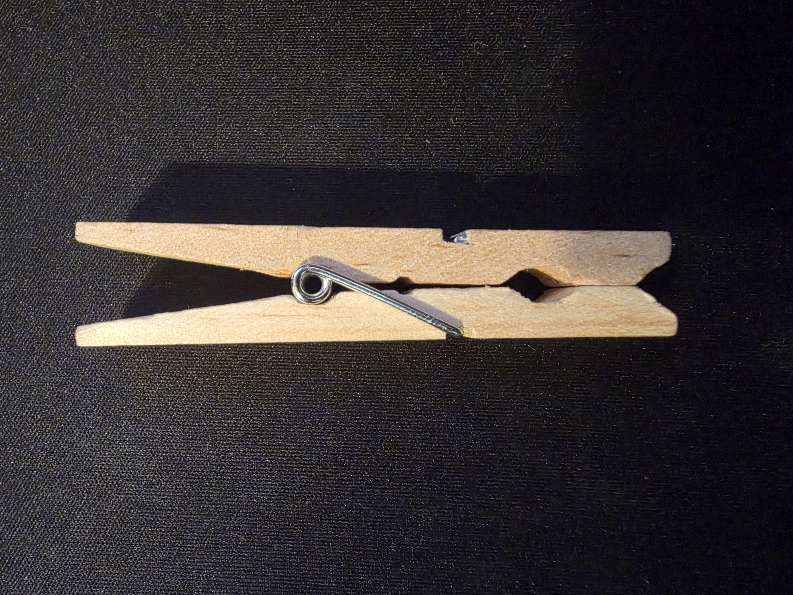
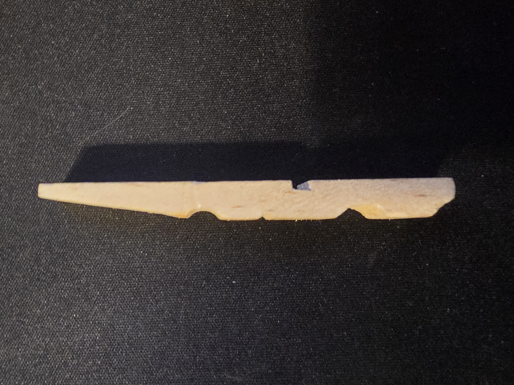
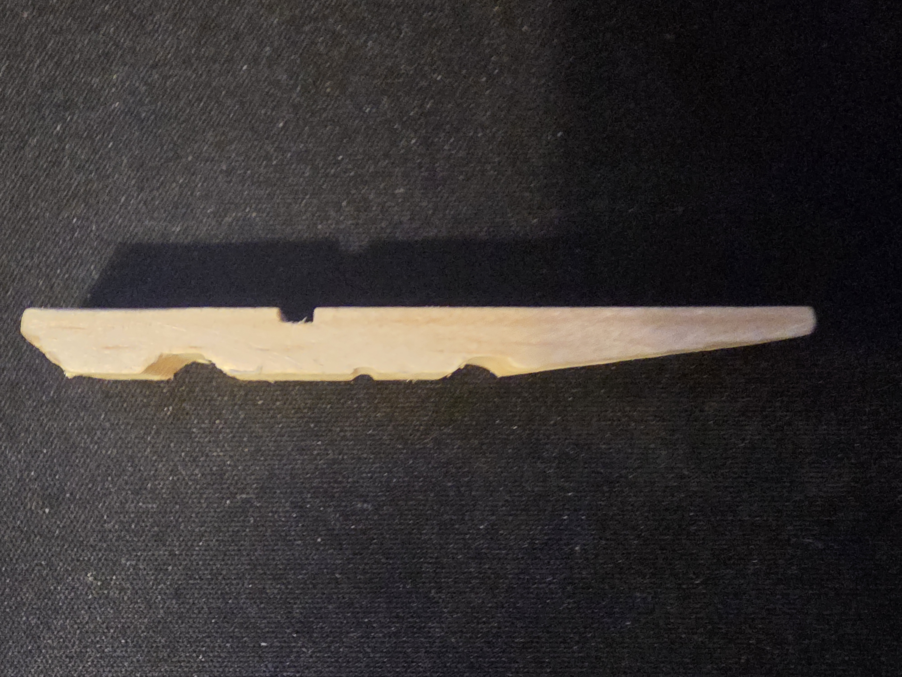
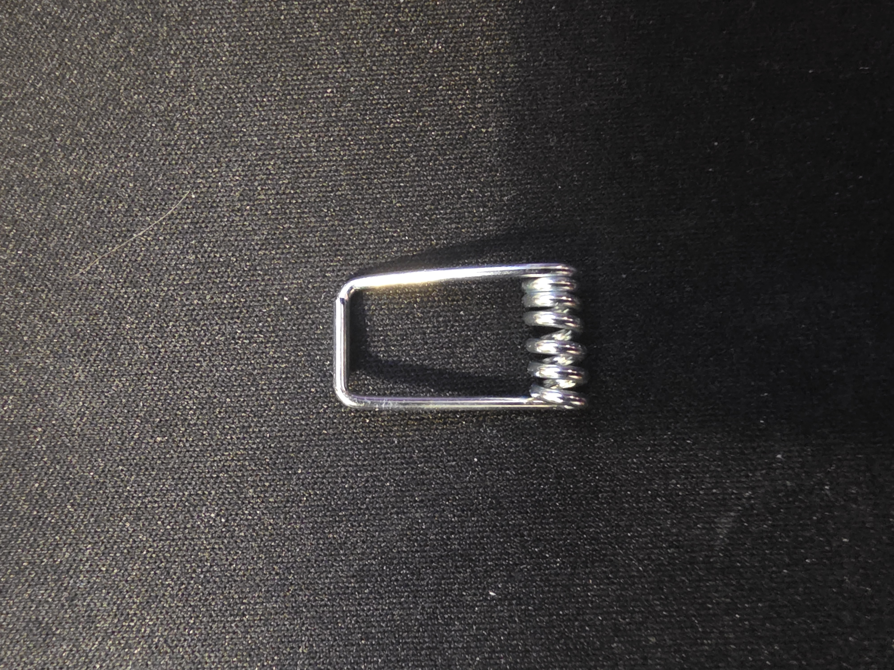

# A1 – Build Your Professional Portfolio

## Decide

### Decision 1 – Homepage Identity
The homepage is designed for prospective employers, engineering colleagues, and course evaluators who need to understand the portfolio without prior knowledge of the course. The site is identified as Kadin Bittner’s MEGR 2157 engineering portfolio and explains that each assignment follows the Analyze, Decide, and Communicate format. The homepage also describes the semester’s progression from individual component analysis to the design of a complete mechanical system. These elements allow a visitor to identify the portfolio’s purpose, organization, intended audience, and documentation standard before selecting a project.

### Decision 2 – Intentional Customization
The template’s primary color was changed from green to blue. The blue color maintains contrast between the navigation elements, headings, and white page background while creating a connection to technical drawings and engineering documentation. The blue color creates visual importance without changing the standard navigation structure.

### Decision 3 – Documentation Standard
Every assignment entry will state its objective, governing model, assumptions, calculations, decision criteria, and verified result with enough dimensions, units, figures, and information for another engineering student to reproduce the work without additional explanation.

## Objective
The objective of this assignment is to establish a live engineering portfolio that documents technical work through analysis, justified design decisions, and reproducible communication. This assignment evaluates engineering portfolios, applies a governing mechanical model to a physical product, and establishes documentation requirements for future MEGR 2157 projects. The completed site is intended to provide peers in engineering and possible employers with an organized record of the assumptions, calculations, selection criteria, and reasoning used throughout the design process.

## Analyze

### Task A

#### Portfolio 1: Ethan's MIT Maker Portfolio
**Portfolio URL:** https://elchun.github.io/project_pages/maker_portfolio

##### Navigability
A specific project from Ethan's page can be located in under 60 seconds due to the headers being the beginning of each project description, such as "Belt Grinder" and "Pedestal Grinder." This type of organization allows for each project to be viewed on a single page continuously. The portfolio does not provide a table of contents or a menu to quickly access a specific project, which is disadvantageous if the user is trying to locate a project closer to the bottom of the document. While the 60 second requirement was met, a table of contents or project menu would make the page more easily navigable.

##### Reproducibility
The portfolio explains general steps taken to complete each project, but does not evaluate each project enough to completely reproduce the end results. One example of this is present in the CNC project, which discusses moving gantry concepts, epoxy-granite mixture testing, precision granite plates, and CAD files. However the document does not include the specific dimensions, CAD files, component specifications, calculations, or manufacturing procedures. An engineer could understand the concept of the design and the general development process, but would not be able to reproduce the CNC machine with this information. The documentation gives conceptual understanding of each project but does not meet the standard for complete reproducibility.

##### Evidence of Reasoning
The portfolio provides sufficient evidence of how design decisions developed. Using the CNC project as an example, the first moving-gantry design was scrapped because of material cost, leading to multiple design revisions. Concrete was initially selected because of its cost and damping properties, but research concerning stability led to the discovery and consideration of epoxy granite. The design changed again when precision granite surface plates became available. Other projects exhibit similar failures and corrections. For example, oscillation in the electric shopping cart led to adding mass to increase the front axle’s moment of inertia and later to the installation of a liquid damper. These examples demonstrate a process involving problem identification, evaluation, testing, and modification. The reasoning is mostly subjective due to the specifics of each project being unknown.

##### Professional Tone
The portfolio demonstrates experience through specific descriptions of machining, welding, CAD, material selection, and mechanical troubleshooting. It also identifies measurable information in several places, including milling-machine backlash below 0.002 inches and an electric-bike speed of approximately 25 miles per hour. These details help an engineer evaluate the scale, quality, and performance of the work. However, expressions such as “yikes,” “not too shabby,” and “And it’s done!!!” create a conversational tone not appropriate for a formal document submitted to an employer. The portfolio acts as a more personal log than a demonstration of practical experience, but in the case of presenting the portfolio to an employer, this document would be strengthened by concise project objectives, specific requirements, labeled figures, formal results, and links to technical drawings or CAD files.

#### Portfolio 2: Nathan Hoong’s Engineering Portfolio
**Portfolio URL:** https://nhoong.github.io/index.html

##### Navigability
A specific project could be located in approximately 15 seconds because the portfolio presents all projects on one continuous page with prominent headings such as “Glaukos, Senior Capstone Project,” “Butterfly Valve,” and “Wobbler Engine.” The navigation bar also provides direct links to the portfolio, work experience, résumé, LinkedIn profile, and GitHub account. However, it does not include a project index or direct links to individual projects. A reader can satisfy the 60-second requirement by scrolling through the headings, but finding a project near the bottom requires scanning past every preceding entry.

##### Reproducibility
The portfolio provides objectives, final results, CAD images, an exploded view, a bill of materials, an electrical schematic, and selected programming diagrams. For example, the shock-top project includes multiple assembly views and a bill of materials, while the automated test-fixture project shows initialization, homing, timeout, and shutdown sequences. Most projects, however, do not provide complete dimensions, material specifications, calculations, manufacturing procedures, source files, or testing instructions. An engineer could identify the intended operation of each design but could not reproduce most projects without requesting additional technical information. The Glaukos capstone project provides a link to a full report, which offers a greater degree of reproducibility than the information displayed directly on the portfolio page.

##### Evidence of Reasoning
The portfolio presents project objectives and final results rather than the complete decision-making process. For example, the surgical tool project identifies a socket-style locking mechanism and explains that the tool can be disassembled for cleaning, but it does not compare that mechanism with alternative locking systems or provide selection criteria. Similarly, the butterfly-valve project explains how the throttle cable pivots the arm to regulate airflow, but it does not document calculations, rejected concepts, material selection, testing, or design revisions. The portfolio demonstrates what was designed and how the final product functions, but it provides limited evidence showing how alternatives were evaluated and why the final configurations were selected.

##### Professional Tone
The portfolio uses project headings, objective statements, technical terminology, and measurable results. For example, the capstone fixture reports force-measurement error of ±1%, and the wobbler engine is reported to operate at a minimum pressure of 1.3 psi and to have placed third among 24 entries. These quantified results help an engineering employer assess performance. The inclusion of a résumé, work experience, LinkedIn profile, and GitHub account also supports employment-oriented use. However, several descriptions contain grammatical errors, repeated image captions, and incomplete explanations. The presentation would be strengthened by editing the text for consistency, labeling every figure uniquely, and organizing each project into requirements, methods, design decisions, and verified results.

### Task B – Product Analysis

#### Product Selection
The selected product is a spring-loaded wooden clothespin. It is primarily mechanical because it uses two rigid levers and a torsion spring to convert an applied hand force into rotational movement at the jaws. It contains three individual components: two wooden lever arms and one formed-wire spring.

#### Primary Engineering Function
The primary function of the clothespin is to apply a continuous compressive clamping force that resists the separation and sliding of fabric placed against a clothesline. Compressing the handles causes the wooden arms to rotate about the spring-supported fulcrum and separate the jaws. Releasing the handles allows the spring to rotate the arms in the opposite direction and close the jaws.

#### Governing Model

The primary action is shown by static moment equilibrium about the fulcrum:

M_O = 0

For one wooden arm:

F_hL_h + F_jL_j - M_s = 0

Solving for the jaw force:

F_j = (M_s-F_hL_h)/(L_j)

When the handles are released, \(F_h=0\), resulting in:

F_j = (M_s)/(L_j)

The spring moment can be estimated using:

M_s = k_0 * 0

where:

- \(F_h\) = force applied by the user to one handle, in newtons
- \(F_j\) = clamping force applied by one jaw, in newtons
- \(L_h\) = perpendicular distance from the fulcrum to the hand force, in meters
- \(L_j\) = perpendicular distance from the fulcrum to the jaw contact point, in meters
- \(M_s\) = moment produced by the spring, in newton-meters
- \(k_0) = torsional spring constant, in newton-meters per radian
- \(0) = angular displacement of the spring, in radians
- \(O\) = fulcrum about which each wooden arm rotates

#### Product Measurements
The assembled clothespin has an overall length of **66.675 mm**, a maximum width of **12.7 mm**, and a thickness of **12.7 mm**. The distance from the fulcrum to the handle contact point is approximately **31.75 mm**, while the distance from the fulcrum to the jaw contact point is approximately **31.75 mm**.

#### Assembled Product

*Figure 1. Assembled wooden clothespin selected for analysis.*

The clothespin contains two wooden levers and one wire torsion spring. The spring holds the levers together, establishes the fulcrum, and creates the moment that closes the jaws.

#### Components and Geometry

##### Component 1 – First Wooden Lever

*Figure 2. First wooden lever removed from the clothespin.*

The first wooden component acts as a rigid lever that rotates about the spring fulcrum. Its rear portion forms the handle where the user applies force. The distance between the handle and fulcrum creates a moment arm that allows the applied force to open the jaws. The central half-circle recess locates the spring coil and creates the axis of rotation. The tapered jaw guides fabric into the clamping region, while the curved inner groove partially conforms to the clothesline and restricts sliding.

##### Component 2 – Second Wooden Lever

*Figure 3. Second wooden lever removed from the clothespin.*

The second wooden component mirrors the first lever and completes the opposing jaw. Its central recess contacts the opposite side of the spring coil to create a shared fulcrum. The matching handle allows the user to apply force to both levers simultaneously. The two curved jaw grooves partially surround the clothesline when closed, increasing contact and helping prevent the line from escaping the jaws.

##### Component 3 – Formed-Wire Torsion Spring

*Figure 4. Formed-wire spring removed from the clothespin.*

The metal spring performs three mechanical functions. Its central coil forms the rotational fulcrum, its two straight arms apply closing moments to the wooden levers, and its bent ends engage the outer grooves in the wood. Compressing the handles increases the spring’s angular displacement and stores elastic strain energy. Releasing the handles allows the spring to return toward its unloaded position and rotate the jaws closed.

#### Patent Research
The analyzed clothespin is most similar to [U.S. Patent No. 365,755A](https://patents.google.com/patent/US365755A/en), titled *Clothes-pin*.

- **Patent number:** US365755A
- **Inventor:** Solon E. Moore
- **Patent date:** June 28, 1887
- **Patent link:** https://patents.google.com/patent/US365755A/en

The patent describes two wooden clamping sections with beveled jaws, clothesline grooves, fulcrum recesses, and a spring made from one piece of wire. The spring contains a central coil that acts as a movable fulcrum and arms that compress the clamping end. These features are close to the geometry of a modern wooden spring clothespin.

An earlier spring-clamp design was patented by David M. Smith in [U.S. Patent No. 10,163A](https://patents.google.com/patent/US10163A/en) in 1853. Moore’s later patent more closely represents the modern clothespin because its formed-wire component acts as the spring, fulcrum, and retaining element.

#### Alternative Solutions

1. **One-piece slotted wooden peg:** A wooden peg with a longitudinal slot secures fabric by being pushed over the fabric and clothesline. Elastic bending of the separated wooden prongs produces the gripping force.

2. **Binder clip:** A formed sheet-steel body and two wire handles can clamp fabric to a clothesline. Elastic deformation of the steel body produces the clamping force, while rotation of the wire handles opens the jaws.

#### Design Decision
A specific design decision was forming the spring and fulcrum from one continuous piece of wire. The spring coil fits inside the central recesses of the wooden levers, while its extended arms fit into grooves on their outer surfaces. This construction eliminates separate hinge pins, fasteners, and springs. Reducing the number of components simplifies assembly, lowers manufacturing complexity, and provides a consistent closing moment at the jaws. The geometry satisfies both the mechanical requirement of maintaining clamping force and the manufacturing requirement of minimizing assembly operations.
