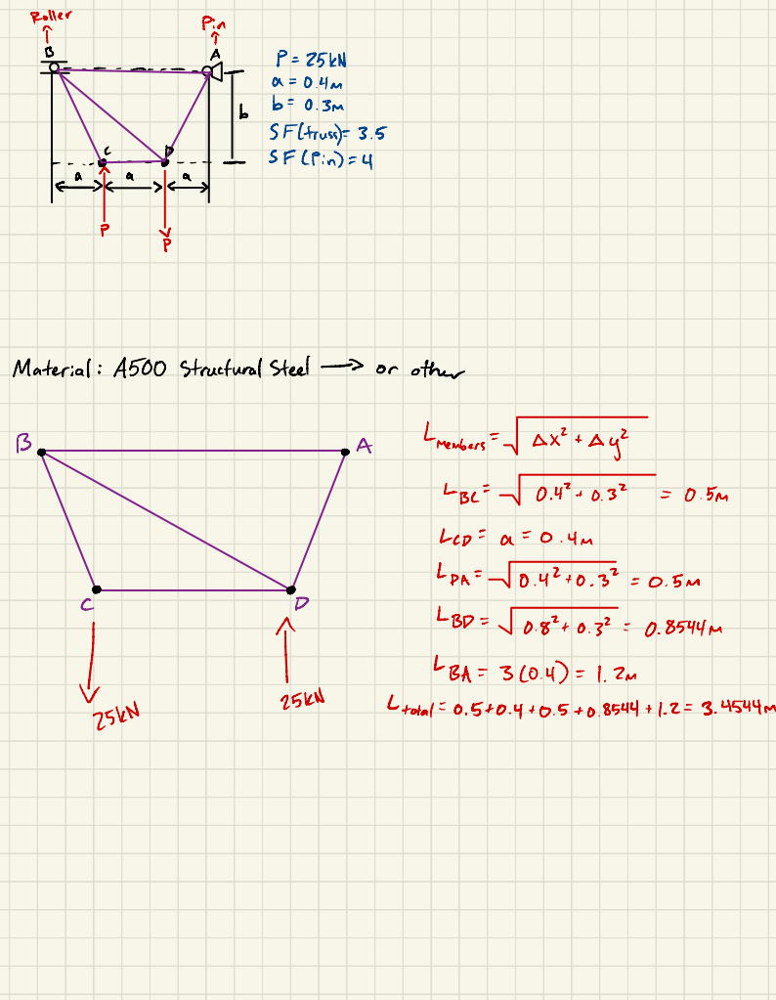
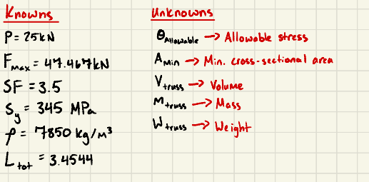
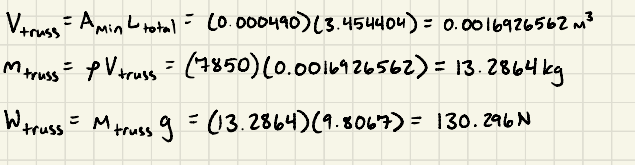
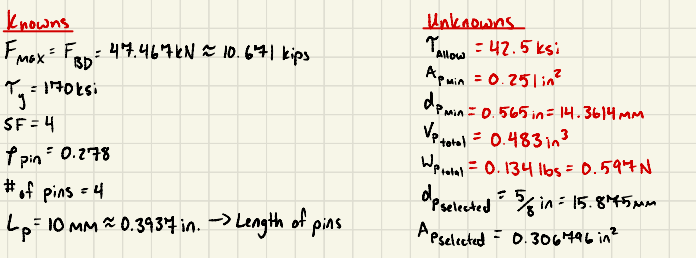
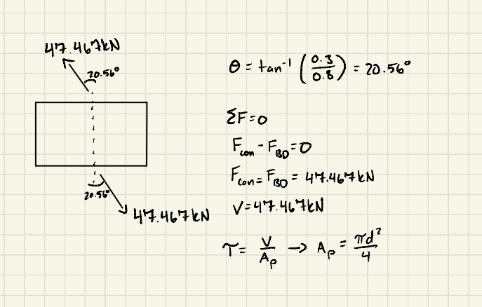
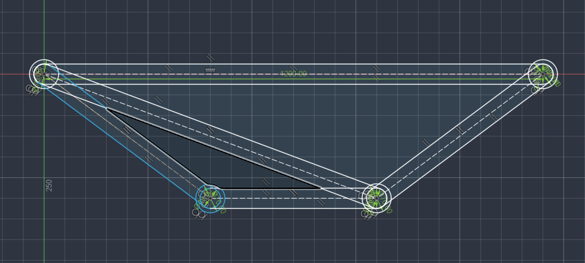
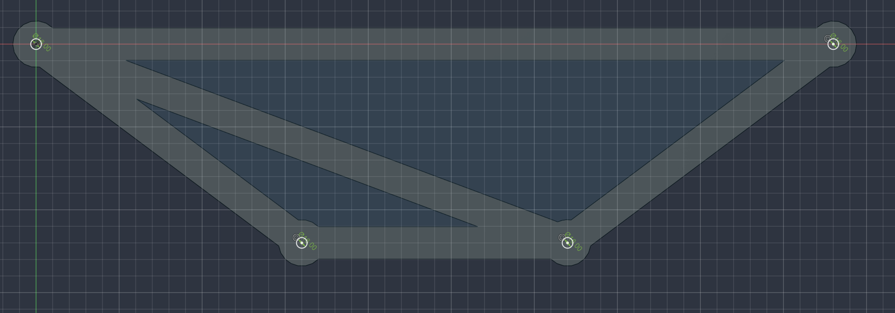
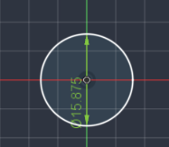
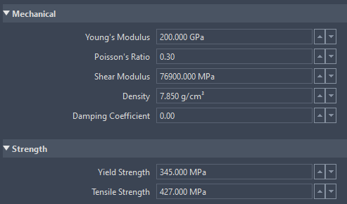
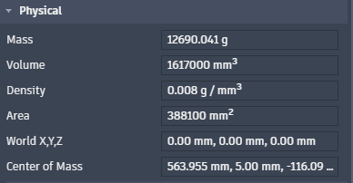

# A2 - Truss Stress Analysis

## Objective

The objective of this project was to design a lightweight planar truss capable of supporting two opposing 25 kN loads. The truss members were designed using ASTM A500 Grade C steel with a required safety factor of 3.5. The connecting pins were designed using hardened tool steel with a required safety factor of 4. Hand calculations were used to determine the internal forces, required member area, pin dimensions, and approximate weight before the design was modeled in Fusion 360.

## Analyze

### Design Requirements

A load of 25 kN was selected from the permitted range of 20 kN to 30 kN. The required horizontal dimension was a = 0.4 m, and the required vertical dimension was b = 0.3 m. Every truss member was required to have the same cross-sectional area, and every connecting pin was required to have the same diameter.

Point A was modeled as a pin support, while point B was modeled as a roller support. The truss, excluding its pins, was required to be represented as one continuous CAD part. The assignment also allowed the assumption that members in compression would not fail through buckling.

### Truss Geometry

A four-joint, five-member truss was selected. The members were AB, BC, CD, DA, and BD. This arrangement formed two connected triangular regions and provided a simple, stable geometry.

The joint coordinates used in Fusion 360 were:

B = (0 mm, 0 mm)

C = (400 mm, -300 mm)

D = (800 mm, -300 mm)

A = (1200 mm, 0 mm)

Moving point B to the origin did not change the required dimensions or geometry.

### Static Determinacy

The truss contained five members, four joints, and three support-reaction components. The planar-truss determinacy equation was used to verify that the structure could be solved using the equations of static equilibrium. The complete determinacy calculation is shown below.

The calculation showed that the truss was statically determinate.

### Entire-Truss Free-Body Diagram

An entire-truss free-body diagram was created before the individual joints were analyzed. The pin at A produced horizontal and vertical reactions, while the roller at B produced one vertical reaction. The reactions were found by applying the horizontal-force, vertical-force, and moment equilibrium equations.

The horizontal reaction at A was 0 kN.

The vertical reaction at A was 8.333 kN upward.

The vertical reaction at B was 8.333 kN downward.

The downward reaction at B means the support must be capable of resisting uplift. A captured roller or similar support would be necessary in a physical version of the design.

### Joint Free-Body Diagrams

A separate free-body diagram was created for each joint. Every unknown member force was initially assumed to be in tension and was drawn pointing away from its joint. A negative result indicated that the actual force direction was opposite the assumed direction and that the member was in compression.

### Internal Member Forces

The method of joints was used to calculate the force in each truss member. Joint C was analyzed first because it contained only two unknown member forces. The remaining joints were analyzed after the forces in BC and CD were known.

The force in member AB was 11.111 kN in compression.

The force in member BC was 41.667 kN in compression.

The force in member CD was 33.333 kN in compression.

The force in member DA was 13.889 kN in tension.

The force in member BD was 47.467 kN in tension.

Member BD contained the largest internal force. Therefore, 47.467 kN was used to design the common cross-sectional area of all five members.

### Truss Member Cross-Sectional Area

The minimum member area was determined using the largest internal force, the yield strength of ASTM A500 Grade C steel, and a safety factor of 3.5. A yield strength of 345 MPa was used. The known quantities, unknown quantities, symbolic solution, and numerical solution are shown in the following hand calculations.

The calculated minimum cross-sectional area was 481.546 square millimeters.

A rectangular member measuring 49 mm wide and 10 mm thick was selected. This produced a cross-sectional area of 490 square millimeters.

The selected cross section produced an actual safety factor of 3.561. Since this value was greater than the required safety factor of 3.5, the selected cross section satisfied the design requirement.

### Analytical Truss Weight

The total length of the five truss members was 3.45440 m. The selected area of 490 square millimeters and a steel density of 7850 kilograms per cubic meter were used to estimate the volume, mass, and weight of the truss. The complete calculation is shown below.

The approximate truss volume was 0.001692656 cubic meters.

The approximate truss mass was 13.2864 kg.

The approximate truss weight was 130.296 N.

This analytical calculation treated each member as a complete prism. Therefore, it counted some overlapping material at the joints more than once.

### Pin Design

The connecting pins were designed using the largest transmitted force of 47.467 kN. The pins were made from hardened tool steel with a shear yield strength of 170 ksi and a density of 0.278 pounds per cubic inch. The pins were analyzed as single-shear connections using a safety factor of 4.

The known quantities and unknown quantities are shown below.

A free-body diagram was created for the pin carrying the largest force. The diagram contained two equal and opposite forces and one shear plane.

The symbolic and numerical pin calculations are shown below.

The minimum required pin area was 0.251081 square inches.

The minimum required pin diameter was 0.565408 inches.

A standard 5/8-inch pin was selected. This was equivalent to a diameter of 0.625 inches or 15.875 mm.

The selected pin area was 0.306796 square inches. The selected pin produced an actual safety factor of 4.888, which exceeded the required safety factor of 4.

Four pins were used in the completed model. Their approximate combined weight was 0.59749 N.

### Failure Modes

ASTM A500 steel was treated as a ductile material because it can undergo plastic deformation before fracture. If a tension member were overloaded, yielding would be expected before tensile fracture. Member BD was the most highly loaded tension member and was therefore the most likely member to experience tensile yielding.

Members AB, BC, and CD were in compression. Buckling would normally be an important failure mode for slender compression members. However, the assignment specifically allowed the assumption that the compression members would not fail through buckling. With buckling excluded, compressive yielding was considered the expected failure mode for the compression members.

The likelihood of member failure could be reduced by increasing the member cross-sectional area, shortening the unsupported member lengths, adding lateral bracing, or using a material with a greater yield strength. Increasing the area would reduce the normal stress but would also increase the weight of the truss.

The connecting pins were loaded in single shear. If a pin were overloaded, shear yielding across the single shear plane would be the expected failure mode. The likelihood of pin failure could be reduced by increasing the pin diameter or redesigning the joint as a double-shear connection.

## Decide

### Load Selection

A load of 25 kN was selected because it was at the midpoint of the permitted 20 kN to 30 kN range. This provided a representative loading condition without using either extreme of the permitted range. All member and pin calculations were based on this selected load.

### Geometry Selection

A four-joint, five-member truss was selected because it formed stable triangular regions and satisfied the equation for a statically determinate planar truss. The simple arrangement reduced the number of members required to carry the loads. Using fewer members also helped reduce the total material and weight.

### Member-Size Selection

A 49 mm by 10 mm rectangular cross section was selected instead of using the exact minimum area of 481.546 square millimeters. The selected dimensions produced an area of 490 square millimeters and were easier to model in Fusion 360. This area provided a safety factor slightly greater than 3.5 without adding a large amount of unnecessary material.

### Pin-Size Selection

A 5/8-inch pin was selected because the calculated minimum diameter of 0.565408 inches was slightly greater than 9/16 inch. The selected diameter produced a safety factor of 4.888. A larger pin was not selected because it would add unnecessary material and weight.

### Joint-Pad Selection

Circular joint pads with diameters of 70 mm were added around the pin locations. The 16 mm pin holes would have reduced the net cross-sectional area below 490 square millimeters if the original 49 mm member width had been maintained through the joint. The enlarged pads left an approximate net area of 540 square millimeters around each hole.

Because 540 square millimeters was greater than the selected member area of 490 square millimeters, the joint areas satisfied the cross-sectional-area requirement.

## Communicate

### Fusion 360 Model

The complete truss was created in Fusion 360 as one continuous part rather than five separate member components. Each member was modeled with a width of 49 mm, and the complete truss was extruded to a thickness of 10 mm. Circular joint pads with diameters of 70 mm were added at points A, B, C, and D.

A 16 mm through-hole was cut at the center of each joint pad. One separate pin component was created with a diameter of 15.875 mm and a length of 10 mm. Four occurrences of the pin were inserted into the assembly and positioned in the four joint holes.

### Material Properties

A custom ASTM A500 Grade C steel material was assigned to the truss. The material density was set to 7850 kilograms per cubic meter. The Young’s modulus was set to 200 GPa, the Poisson’s ratio was set to 0.30, and the yield strength was set to 345 MPa.

A custom hardened tool-steel material was assigned to the pins. The pin density was set to 0.278 pounds per cubic inch. The provided shear yield strength of 170 ksi was used in the hand calculations instead of being entered as Fusion’s tensile yield strength.

### CAD Mass Properties

Fusion 360 was used to determine the predicted mass of the completed truss and pin assembly. The material properties were assigned before the assembly properties were measured. The Fusion 360 mass-properties result is shown below.

The CAD assembly mass was 12.690041 kg.

The corresponding CAD assembly weight was 124.447 N.

The analytical truss mass was 13.2864 kg. After adding the approximate pin mass, the complete analytical assembly mass was 13.3473 kg.

The percent difference between the analytical and CAD assembly masses was 4.925 percent. The CAD value was lower because the analytical calculation counted the complete length of every member, including overlapping regions. Fusion 360 merged the intersecting members into one body and removed the material cut from the pin holes.

### Engineering Lessons Learned

This project demonstrated that the initial direction assumed for a member force affects how the final result is interpreted. A negative force did not mean the calculation was incorrect. It indicated that the member was in compression instead of the initially assumed tension.

The project also demonstrated that a pin hole reduces the available cross-sectional area at a connection. The original member area was large enough away from the joints, but additional material was required around the holes. Enlarging the joint pads prevented the pin holes from becoming the weakest cross sections.

The CAD model demonstrated how overlapping geometry affects weight calculations. The analytical method counted overlapping member material more than once, while Fusion 360 counted the merged material only once. This produced a reasonable difference between the analytical and CAD weight predictions.

### Mistakes and Revisions

During the first CAD extrusion, Fusion 360 filled the triangular openings because all closed sketch profiles were selected. The unwanted triangular material was removed using an extrude cut through the complete thickness. This created the intended open truss structure.

The pins initially moved together because they were copied as bodies instead of being inserted as separate component occurrences. The pin was converted into a component and inserted four separate times. This allowed each pin to be positioned independently.

The first joint design did not account for the material removed by the pin holes. Circular 70 mm pads were added around the joints to maintain the required net cross-sectional area. This revision prevented the connection regions from being weaker than the main members.

### Time Required

Geometry selection and initial sketch: [Enter time]

Free-body diagrams: [Enter time]

Static calculations: [Enter time]

Member and pin design: [Enter time]

Fusion 360 modeling: [Enter time]

CAD revisions and mass properties: [Enter time]

Portfolio documentation: [Enter time]

Total time: [Enter total time]

### CAD File Download

The completed Fusion 360 truss and pin assembly can be downloaded below.

[Download the A2 truss CAD files](a2-truss-assembly.f3z)

### References

Oberg, E., Jones, F. D., Horton, H. L., and Ryffel, H. H. Machinery’s Handbook, 31st edition. Industrial Press. “Stress and Strain/Working Stress,” page 212, and “Simple Stresses,” pages 216 through 218.

ASTM International. “ASTM A500/A500M: Standard Specification for Cold-Formed Welded and Seamless Carbon Steel Structural Tubing in Rounds and Shapes.”
[ASTM A500/A500M](https://store.astm.org/a0500_a0500m-23.html)

American Institute of Steel Construction. “Steel Availability and Material Specifications.” Modern Steel Construction, June 2022.
[AISC publication](https://www.aisc.org/globalassets/modern-steel/archives/2022/june2022.pdf)
