# A3: Parametric Design and Finite Element Analysis

## Objective

The objective of this assignment was to design an aluminum rectangular bar that would have a maximum axial deflection of 0.009 inches under an axial tensile load. The dimensions of the bar were inputted using parameters in Fusion 360. A finite element analysis (FEA) was then completed to determine the displacement, von Mises stress, and safety factor. The theoretical displacement was compared with the FEA displacement to evaluate the accuracy of the results.

## Design Requirements

The bar was designed using the following requirements:

- Applied load between 300 and 500 lbf
- Maximum axial deflection of 0.009 in
- Aluminum material
- Modulus of elasticity between 8,500,000 and 11,500,000 psi
- Yield strength of 40 ksi
- Rectangular cross-section
- Parametrically determined bar length

## Selected Values

The following values were selected for the design:

- Load: 400 lbf
- Modulus of elasticity: 9,993,100 psi
- Modulus of elasticity: 68.9 GPa
- Maximum deflection: 0.009 in
- Width: 0.500 in
- Height: 0.250 in
- Yield strength (S_y): 40 ksi

## Hand Calculations

The hand calculations were completed using the direct-tension elongation equation. These calculations were used to determine the required length of the bar, the nominal axial stress, and the theoretical safety factor.

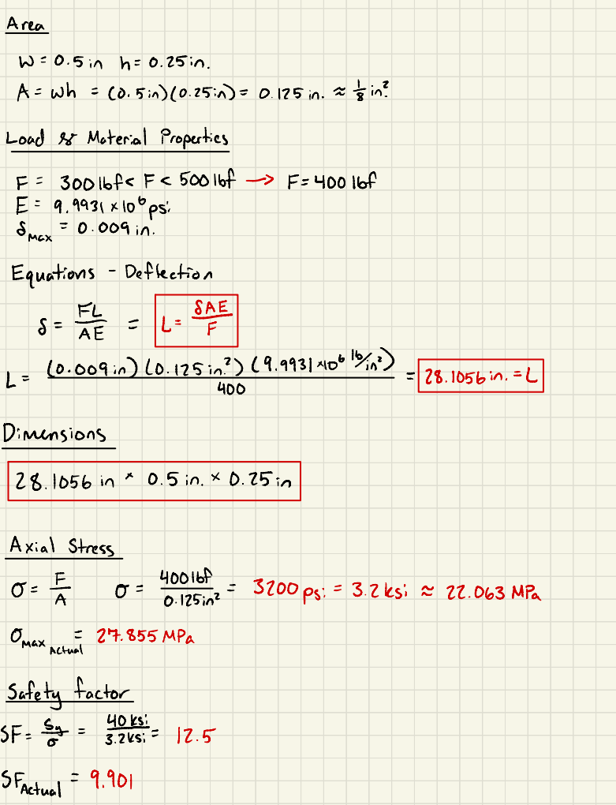

*Figure 1. Hand calculations for the rectangular bar.*

The calculated results were:

- Cross-sectional area: 0.125 in^2
- Required bar length: 28.1056 in
- Nominal axial stress: 3.200 ksi
- Nominal axial stress: 22.063 MPa
- Theoretical safety factor: 12.5
- Expected axial deflection: 0.009 in
- Expected axial deflection: 0.2286 mm

## Parametric CAD Model

The rectangular bar was created in Fusion 360. Parameters were assigned to the width, height, load, modulus of elasticity, maximum deflection, and length.

The following parameters were used:

- Width = 0.500 in
- Height = 0.250 in
- Load = 400 lbf
- Elastic Modulus = 9,993,100 psi
- Maximum Deflection = 0.009 in
- Length = 28.1056 in

The width and height parameters controlled the dimensions of the rectangular cross-section. The length was determined from the selected load, material property, cross-sectional dimensions, and maximum allowable deflection.

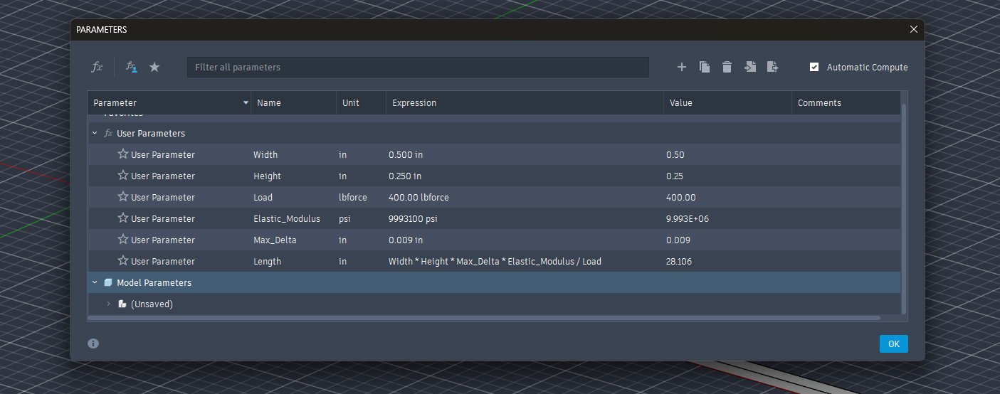

*Figure 2. Parameters used to control the dimensions of the bar.*

The final dimensions of the bar were 28.1056 inches long, 0.500 inches wide, and 0.250 inches high.

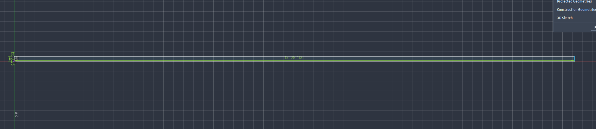
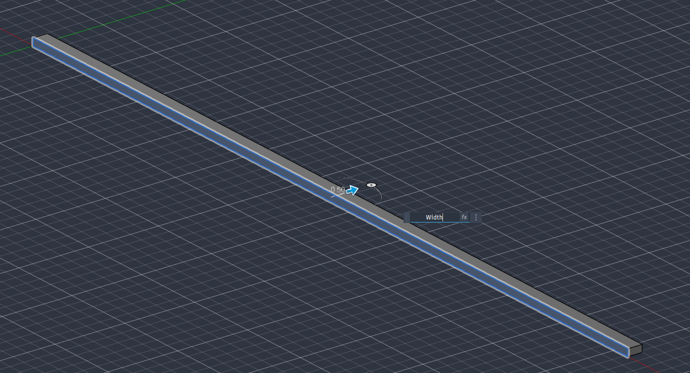
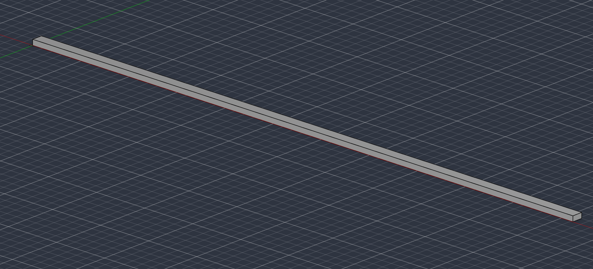

*Figure 3. Completed rectangular bar in Fusion 360.*

## Finite Element Analysis

A static stress analysis was completed in Fusion 360. The analysis used the same geometry, material, and load as the hand calculations.

## Material

An aluminum material was assigned to the bar. The modulus of elasticity was set to 68.9 GPa, which is equal to 9,993,100 psi. The material had a yield strength of 40 ksi.

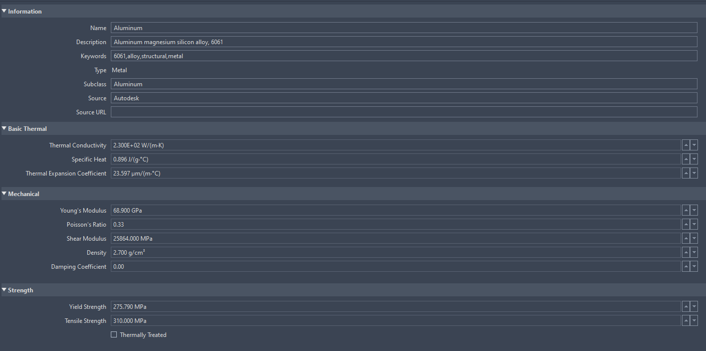

*Figure 4. Aluminum material properties used in the analysis.*

## Constraint

One complete end face of the bar was fixed. This prevented that end from moving in any direction.

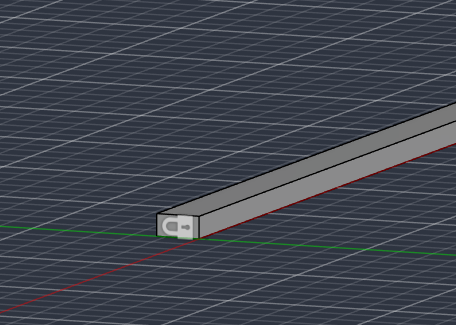

*Figure 5. Fixed constraint applied to one end of the bar.*

## Applied Load

A tensile load of 400 lbf was applied to the complete opposite end face. The load was converted to 1,779.29 N for the simulation. The force was applied in the X direction because the length of the bar was aligned with the X-axis.

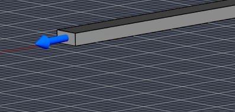

*Figure 6. Tensile load applied in the X direction.*

## Mesh

A solid mesh was generated across the complete bar. The mesh divided the model into smaller elements so Fusion 360 could calculate the stress and displacement.

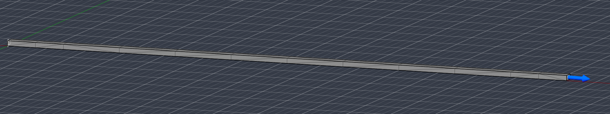

*Figure 7. Mesh used for the finite element analysis.*

## Deflection Results

The finite element analysis produced a maximum displacement of 0.229 mm. The maximum displacement occurred at the loaded end of the bar, while the fixed end remained at zero displacement.

The hand calculation predicted a displacement of 0.2286 mm. The FEA result of 0.229 mm was extremely close to the hand-calculated result.

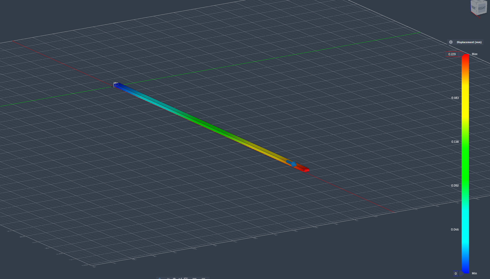

*Figure 8. Deflection map produced by the finite element analysis.*

## Von Mises Stress Results

The hand calculation predicted a nominal axial stress of 22.063 MPa. The finite element analysis produced a slightly higher maximum stress near the fixed end.

The approximate maximum von Mises stress was 27.775 MPa. This value was still far below the aluminum yield strength of 275 MPa.

The higher stress near the fixed end was likely caused by the fixed condition preventing the end of the bar from contracting naturally as it stretched. Most of the bar had a stress closer to the hand-calculated value.

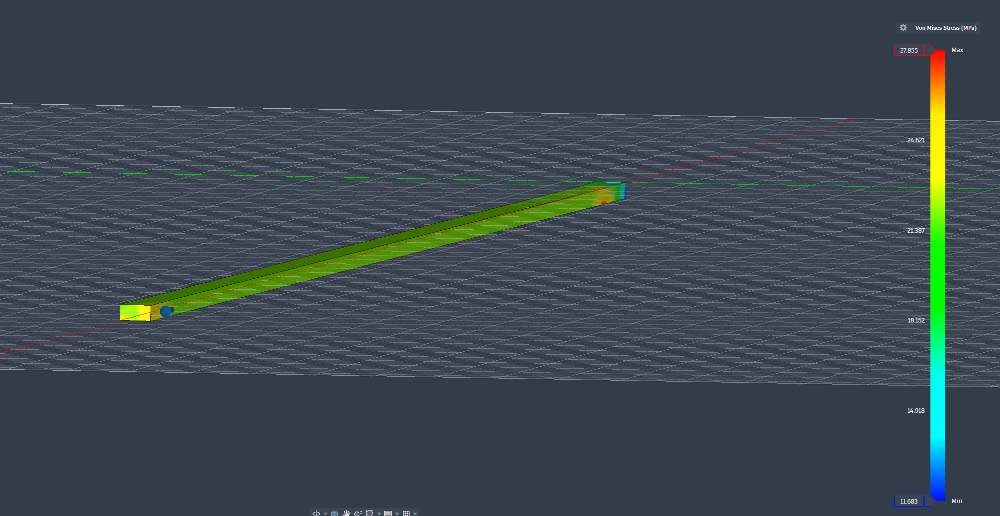

*Figure 9. Von Mises stress map produced by the finite element analysis.*

## Safety Factor

The theoretical safety factor from the hand calculation was 12.5. Fusion 360 reported a minimum safety factor of 9.901.

The FEA safety factor was lower because it was based on the maximum stress near the fixed end rather than the uniform stress through the main portion of the bar.

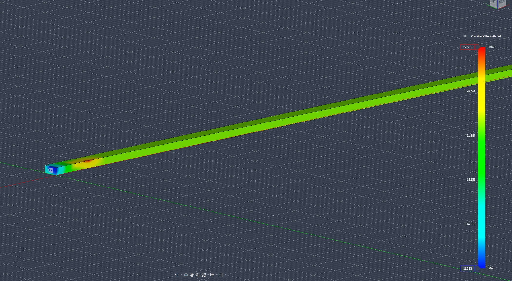

The minimum safety factor was still greater than one, and the maximum stress remained below the yield strength of the aluminum. Therefore, the bar passed the strength requirement.

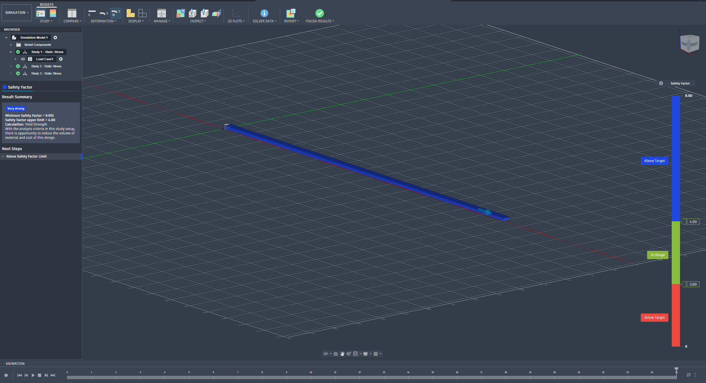

*Figure 10. Safety factor map produced by the finite element analysis.*

## Comparison of Results

The hand-calculated deflection was 0.2286 mm.

The FEA deflection was 0.229 mm.

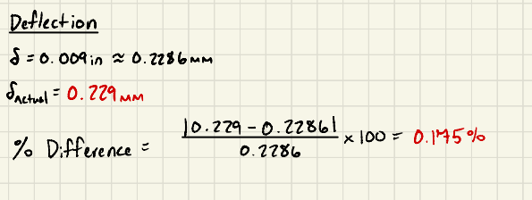

The percent difference between the results was 0.175%.

The two deflection values were essentially the same. This agreement was expected because both methods used the same dimensions, applied load, and material properties. The bar also had a uniform cross-section and was loaded directly along its length.

The small difference was likely caused by rounding and the way Fusion 360 divided the bar into mesh elements for the analysis.

For this simple bar, the hand calculation is highly reliable because the direct-tension equation closely represents the actual geometry and loading. The FEA result also provides confidence that the dimensions, material properties, constraint, and applied force were entered correctly.

## Pin-Hole Stress Concentration

## Pin-Hole Stress Concentration

A 0.250-inch-diameter pin hole was assumed near the left side of the bar. The hole was centered across the 0.500-inch width and extended through the 0.250-inch thickness. The selected hole diameter was considered substantial because it was equal to half the width of the bar.

The stress concentration factor was estimated for a finite-width flat bar containing a centered circular hole. The nominal stress through the reduced section was used to estimate the peak stress around the hole. The resulting peak stress was then compared with the aluminum yield strength to determine the new safety factor.

The completed pin-hole calculations are shown below.

*Figure 11. Stress concentration and safety-factor calculations for the assumed pin hole.*

The estimated results were:

- Hole diameter: 0.250 in
- Hole-diameter-to-width ratio: 0.500
- Stress concentration factor: 2.156
- Estimated peak stress: 13.798 ksi
- Estimated peak stress: 95.131 MPa
- Estimated safety factor: 2.899

The estimated peak stress remained below the aluminum yield strength of 40 ksi. Therefore, the bar would still pass the strength requirement with the assumed 0.250-inch pin hole. However, the estimated safety factor decreased from 12.5 without the hole to 2.899 with the hole.

## Problems Encountered

The first simulation produced an incorrect bending result and a safety factor below one. The load initially appeared to be applied along the bar, but the analysis showed a maximum stress of approximately 328 MPa. This indicated that the bar was experiencing bending instead of direct tension.

The issue was corrected by applying the load specifically in the X direction, which was aligned with the length of the bar. After this correction, the FEA displacement matched the hand calculation and the minimum safety factor increased to 9.901.

Another problem occurred when attempting to create a separate area parameter. Fusion 360 did not provide square inches as a convenient area unit. This was corrected by including the width and height directly in the equation used to determine the bar length.

## Lessons Learned

This assignment demonstrated how the dimensions, applied load, material stiffness, and allowable deflection of a bar are related. Increasing the load would require a shorter bar to maintain the same maximum deflection. Increasing the width or height would increase the cross-sectional area and allow the bar to be longer. Increasing the modulus of elasticity would also allow the bar to be longer because a stiffer material stretches less.

The assignment also showed the importance of checking the direction of an applied load. A small error in the direction of the force can cause bending and produce stress results that are much greater than expected.

Comparing the FEA displacement with the hand calculation was useful for confirming that the final simulation was set up correctly.

## Time Spent

The total time spent completing the assignment was approximately 6 hours.

The time included:

- Completing the hand calculations: 1 hour
- Creating the parametric CAD model: 30 minutes
- Completing and troubleshooting the FEA: 1.5 hours
- Preparing the portfolio page: 3 hours

## Downloadable CAD File

[Download the Fusion 360 CAD file](A3.f3d)

## References

Autodesk. “Parameters Reference.” Autodesk Fusion Help.  
<https://help.autodesk.com/view/fusion360/ENU/?guid=GUID-76272551-3275-46C4-AE4D-10D58B408C20>

Autodesk. “Set Up a Static Stress Analysis.” Autodesk Fusion Help.  
<https://help.autodesk.com/view/fusion360/ENU/?guid=SIM-SSA>

Autodesk. “Standard Results in Static Stress.” Autodesk Fusion Help.  
<https://help.autodesk.com/cloudhelp/ENU/Fusion-Simulate/files/SIM-STATIC-STRESS-RESULTS-CONCEPT.htm>

Oberg, Erik, et al. *Machinery’s Handbook*. 31st edition. Industrial Press.
