# Motor Mount Design

## Objective

The objective of this assignment was to design a PETG motor mount for a 24 V DC gear motor subjected to a 300 N force at the motor shaft. The mount was evaluated using bending stress and beam deflection.

The required safety factor was 3, and the maximum allowed deflection was 0.30 mm. The completed design includes a motor attachment feature, a wall attachment feature, and clearance holes.

## Design Requirements

Applied force: 300 N

Material: PETG

Required safety factor: 3

Maximum permitted deflection: 0.30 mm

Motor shaft diameter: 6 mm

Motor bolt clearance-hole diameter: 3.4 mm

Motor bolt-circle diameter: 22 mm

Feature width: 30 mm

Selected plate thickness: 8 mm

## Material Selection

PETG was selected because it is durable, impact resistant, and appropriate for fused-filament fabrication. The material properties were obtained from the MatWeb overview of PETG copolyester.

PETG yield strength: 48.0 MPa

PETG modulus of elasticity: 1.93 GPa

PETG modulus used in the calculations: 1930 N/mm²

Required safety factor: 3

Allowable stress: 16.0 MPa

[PETG Material Properties](https://www.matweb.com/search/DataSheet.aspx?MatGUID=4de1c85bb946406a86c52b688e3810d0&ckck=1)

## Initial Design Concept

The motor mount was designed as a single L-shaped bracket. Feature 1 is the vertical plate attached to the motor. Feature 2 is the horizontal plate attached to rigid wall A.

Both features are 30 mm wide and use an 8 mm selected thickness. Feature 2 is joined to the top edge of Feature 1 and extends away from the motor. This prevents Feature 2 from obstructing the motor shaft and locating feature.

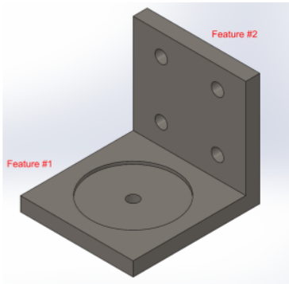

*Figure 1. Initial concept for the motor mount.*

# Feature 1: Motor Attachment

## Feature 1 Knowns and Unknowns

Applied force: 300 N

Force moment arm: 15 mm

Applied moment: 4500 N·mm

Feature width: 30 mm

PETG yield strength: 48.0 MPa

Allowable stress: 16.0 MPa

Elastic modulus: 1930 N/mm²

Required safety factor: 3

Maximum permitted deflection: 0.30 mm

Unknown: Required Feature 1 thickness

## Feature 1 Free-Body Diagram

Feature 1 was approximated as a cantilever beam subjected to an end moment. The force acts at the center of the 30 mm motor plate, producing a 15 mm moment arm.

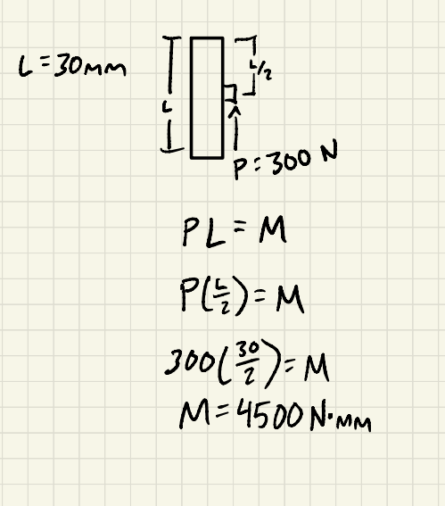

*Figure 2. Free-body diagram for Feature 1.*

## Feature 1 Calculations

The symbolic work, equation substitutions, and numerical calculations for Feature 1 are shown below.

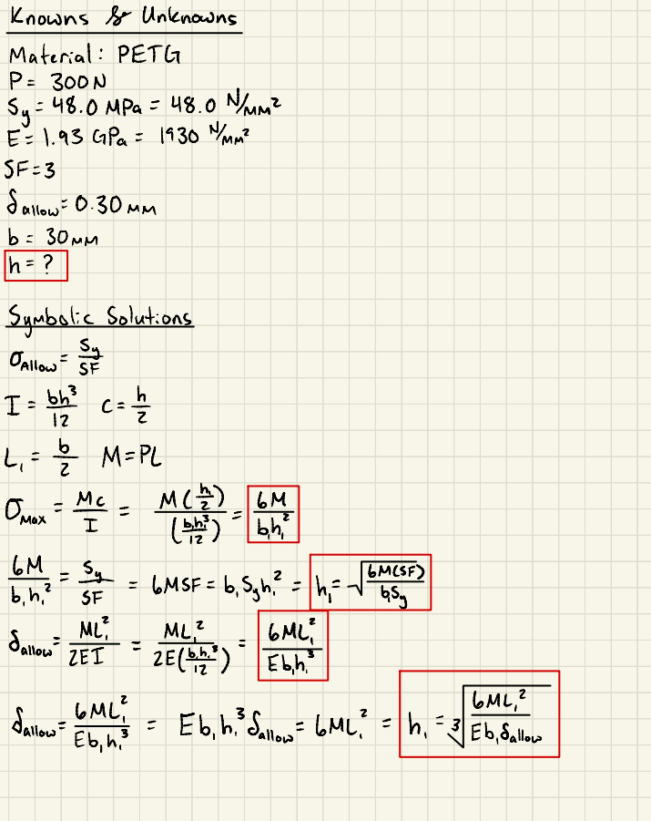

*Figure 3. Stress and deflection calculations for Feature 1.*

## Feature 1 Results

Thickness required by stress: 7.500 mm

Thickness required by deflection: 7.047 mm

Governing requirement: Stress

Minimum calculated thickness: 7.500 mm

Selected thickness: 8 mm

Area moment of inertia: 1280 mm⁴

Maximum calculated stress: 14.063 MPa

Allowable stress: 16.0 MPa

Maximum calculated deflection: 0.205 mm

Maximum permitted deflection: 0.300 mm

The maximum stress is less than the allowable stress, and the maximum deflection is less than the permitted deflection. Therefore, the selected 8 mm thickness satisfies both Feature 1 requirements.

# Feature 2: Wall Attachment

## Feature 2 Knowns and Unknowns

Transferred moment: 4500 N·mm

Free bending length to the first bolt row: 7.5 mm

Feature width: 30 mm

PETG yield strength: 48.0 MPa

Allowable stress: 16.0 MPa

Elastic modulus: 1930 N/mm²

Required safety factor: 3

Maximum permitted deflection: 0.30 mm

Unknown: Required Feature 2 thickness

## Feature 2 Free-Body Diagram

Feature 2 was approximated as a cantilever beam fixed by the wall bolts. The section between the Feature 1 joint and the first effective bolt row was treated as free to bend.

The moment transferred from Feature 1 was applied at the joint.

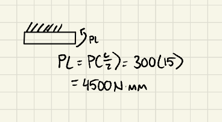

*Figure 4. Free-body diagram for Feature 2.*

## Feature 2 Calculations

The symbolic work, equation substitutions, and numerical calculations for Feature 2 are shown below.

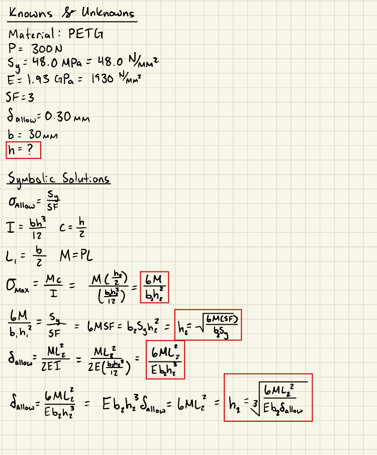

*Figure 5. Stress and deflection calculations for Feature 2.*

## Feature 2 Results

Thickness required by stress: 7.500 mm

Thickness required by deflection: 4.439 mm

Governing requirement: Stress

Minimum calculated thickness: 7.500 mm

Selected thickness: 8 mm

Area moment of inertia: 1280 mm⁴

Maximum calculated stress: 14.063 MPa

Allowable stress: 16.0 MPa

Maximum calculated deflection: 0.05123 mm

Maximum permitted deflection: 0.300 mm

The maximum stress is less than the allowable stress, and the maximum deflection is less than the permitted deflection. Therefore, the selected 8 mm thickness satisfies both Feature 2 requirements.

# Isometric Sketch

An isometric sketch was produced using the dimensions determined from the Feature 1 and Feature 2 calculations. The sketch includes the L-shaped bracket, motor mounting features, and wall mounting holes.

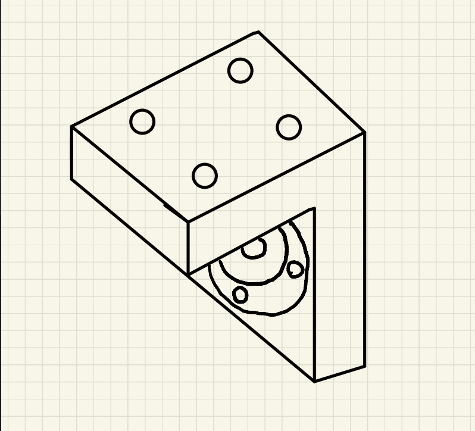

*Figure 6. Isometric hand sketch of the proposed motor mount.*

# Parametric CAD Model

The motor mount was modeled parametrically in Fusion 360. Named parameters were used for the important dimensions so that the model would update consistently if a dimension changed.

## Parametric Values

mountWidth: 30 mm

feature1Height: 30 mm

feature2Length: 30 mm

minThickness: 7.5 mm

plateThickness: 8 mm

motorBCD: 22 mm

motorBoltRadius: 11 mm

boltClearance: 3.4 mm

shaftDiameter: 6 mm

shaftClearance: 7 mm

pilotDiameter: 18 mm

pilotClearance: 18.2 mm

pilotDepth: 2 mm

wallHoleOffset: 7.5 mm

wallHoleSpacing: 15 mm

gussetLength: 12 mm

gussetThickness: 4 mm

filletRadius: 2 mm

overallHeight: 38 mm

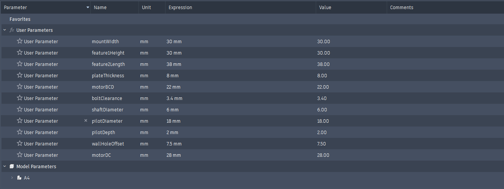

*Figure 7. User parameters used in the Fusion 360 model.*

## Motor Attachment Features

Feature 1 contains a 6 mm shaft-clearance hole and four 3.4 mm motor-bolt clearance holes.

The motor mounting holes were created using a circular pattern on a 22 mm bolt circle. A locating recess was included where required by the motor geometry.

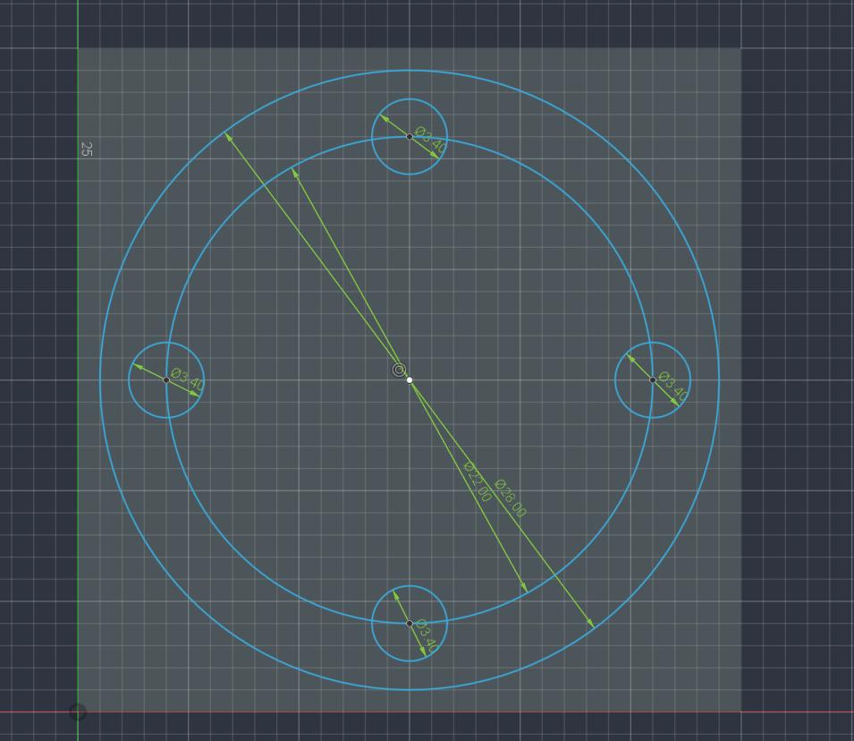

*Figure 8. Shaft opening, locating feature, and motor mounting-hole pattern.*

## Wall Attachment Features

Feature 2 contains four 3.4 mm clearance holes for the wall fasteners. A rectangular pattern was used to place the holes.

The first bolt row was positioned 7.5 mm from the Feature 1 joint. This distance matches the free bending length used in the Feature 2 calculations.

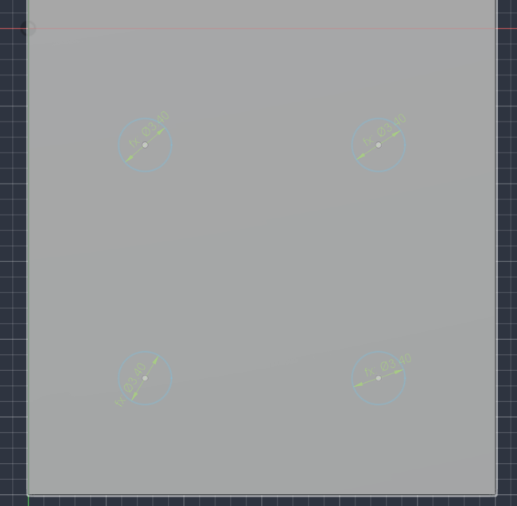

*Figure 9. Parametric wall mounting-hole pattern.*

## Completed CAD Model

The final CAD model consists of one joined body. The motor opening, motor fastener holes, wall fastener holes, gussets, and fillets are controlled by sketches, parameters, and pattern features.

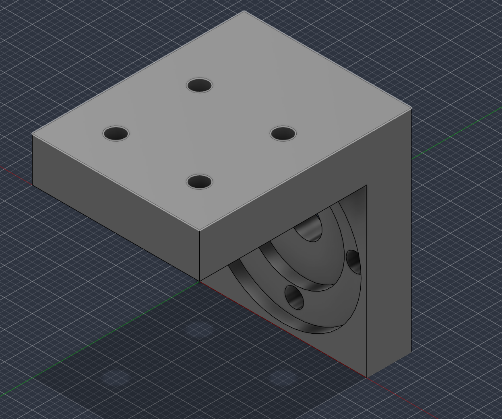

*Figure 11. Completed parametric motor mount.*

## CAD Download

[Download the Fusion 360 motor mount file](INSERT-CAD-DOWNLOAD-LINK-HERE)

# Multiview Drawing

A third-angle multiview drawing was created from the completed CAD model.

The drawing includes:

- Front view
- Right-side view
- Top view
- Isometric view
- Visible lines
- Hidden lines
- Centerlines
- Center marks
- Size dimensions
- Location dimensions
- Hole callouts
- Title block

The drawing was dimensioned so that the motor mount could be manufactured without referring to the original CAD model.

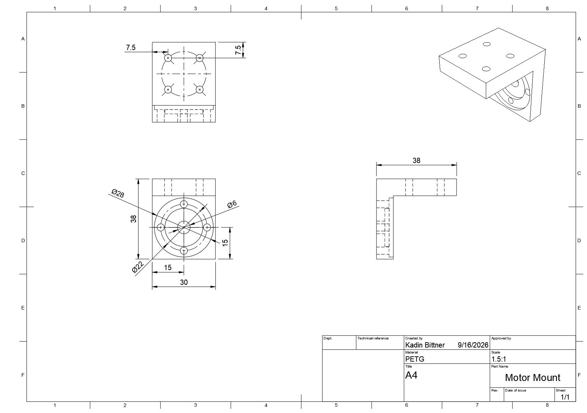

*Figure 12. Dimensioned multiview drawing of the motor mount.*

[Download the motor mount drawing PDF](INSERT-DRAWING-PDF-LINK-HERE)

# Final Design

Feature 1 width: 30 mm

Feature 1 height: 30 mm

Feature 1 thickness: 8 mm

Feature 2 width: 30 mm

Feature 2 length: 30 mm

Feature 2 thickness: 8 mm

Overall height: 38 mm

Motor shaft clearance: 6 mm diameter

Motor bolt clearances: Four 3.4 mm diameter holes

Motor bolt-circle diameter: 22 mm

Wall bolt clearances: Four 3.4 mm diameter holes

First wall-bolt row: 7.5 mm from the Feature 1 joint

Feature 1 maximum stress: 14.063 MPa

Feature 1 maximum deflection: 0.205 mm

Feature 2 maximum stress: 14.063 MPa

Feature 2 maximum deflection: 0.05123 mm

Allowable stress: 16.0 MPa

Maximum permitted deflection: 0.300 mm

Both features satisfy the stress and deflection requirements.

# Design Decisions

The mount width was selected as 30 mm because it provides a compact mounting surface around the motor features.

Stress governed the design of both features. The minimum thickness required by stress was 7.500 mm. The final thickness was increased to 8 mm to provide a practical CAD and manufacturing dimension.

PETG was selected as the manufacturing material. Feature 2 was joined to the upper edge of Feature 1 and extended away from the motor so that it would not block the motor locating feature.

# Documentation of the Process

1. The assignment requirements and motor dimensions were reviewed.

2. PETG material properties were obtained from MatWeb.

3. Feature 1 was approximated as a cantilever subjected to an end moment.

4. Feature 1 was evaluated for stress and deflection.

5. Feature 2 was approximated as a wall-bolted cantilever subjected to the transferred moment.

6. Feature 2 was evaluated for stress and deflection.

7. An 8 mm thickness was selected for both features.

8. An isometric concept sketch was produced.

9. User parameters were created in Fusion 360.

10. Features 1 and 2 were modeled and joined.

11. Motor and wall clearance holes were created using parametric patterns.

12. The completed model was used to generate a multiview drawing.

13. The CAD model and drawing were exported for submission.

# Mistakes and Revisions

During the initial design, Feature 2 was positioned in a way that covered part of the motor locating area. The geometry was revised by attaching Feature 2 to the top edge of Feature 1 and extending it away from the motor. This preserved the complete motor mounting surface.

The initial calculations also treated the entire 30 mm dimension as the beam thickness. The cross section was corrected to 30 mm wide by an unknown thickness. The required thickness was then calculated using the stress and deflection limits, resulting in a selected thickness of 8 mm.

# Time Required

The total time required to complete the assignment was approximately: 8 hours

# Lessons Learned

This assignment demonstrated that CAD dimensions should be supported by engineering calculations. A plate can appear sufficiently large while still failing a stress or deflection requirement. Calculating the required thickness made it possible to determine which design condition governed.

The assignment also demonstrated the value of parametric modeling. Named parameters, patterns, and mirrored features allow the design to update consistently when a dimension changes.

Careful placement of joined features is important because an otherwise useful structural feature can interfere with the motor or fastener geometry.

# References

1. MatWeb. “Overview of Materials for PETG Copolyester.”  
   https://www.matweb.com/search/DataSheet.aspx?MatGUID=4de1c85bb946406a86c52b688e3810d0&ckck=1

2. Machinery’s Handbook, 31st Edition, beam calculations, pages 256–274.

3. Motor manufacturer drawing supplied with the assignment.
