# Design for Strength and Stiffness I

## Objective

Design a bracket and connecting link using strength-of-materials equations to determine dimensions that satisfy stress and deflection requirements. Compare stress-based and stiffness-based dimensions, select appropriate fits, and communicate the results using hand calculations and dimensioned paper drawings.

## Project Requirements

- Material: ASTM A36 steel.
- Force in each strap leg: 600 lbf.
- Total bracket load: 1200 lbf.
- Safety factor: 4.
- Maximum deflection: 0.005 in per feature.
- Complete stress and stiffness calculations for Features A–E.
- Neglect direct shear failure and shear deflection as instructed.
- Create separate stress-based and stiffness-based multiview paper drawings.
- Design a link connecting Feature A to a nominal 1-inch shaft.
- Specify a running/sliding fit at Feature A.
- Specify a fit requiring light assembly pressure at the 1-inch shaft.
- Document assumptions, calculations, decisions, lessons learned, and time spent.

## Analyze

### Material and Loading

A36 steel was selected with a yield strength of 36000 psi and an assumed elastic modulus of 29000000 psi.

The safety factor of 4 gives an allowable normal stress of 9000 psi.

Each strap leg carries 600 lbf. Following the assignment’s strap diagram, the combined bracket load is 1200 lbf.

The specified polyester strap is 0.750 in wide. This width was used as the initial exposed length of Feature A.

### Assumptions

- Loading is static.
- The material behaves linearly elastically.
- The bracket is symmetric.
- Self-weight is neglected.
- Direct shear failure and shear deflection are neglected as instructed.
- Local stress concentrations are omitted from the nominal stress calculations.
- Feature A is a cantilever with a uniformly distributed strap load.
- Feature B is an axially loaded bar, following Appendix D.
- Feature C is a simply supported beam with a centered point load.
- Each Feature D is an axially loaded side member.
- Each Feature E is a cantilever with its contact force concentrated at the free edge.
- Individual stiffness calculations exclude movement of adjoining features.

The axial-only models for B and D omit connection bending. These calculations follow the assignment’s simplified feature models.

## Stress Analysis

### Feature A — Cylindrical Strap Support

Feature A carries a total load of 1200 lbf distributed over an exposed length of 0.750 in.

Known values:

- Total load: 1200 lbf.
- Exposed length: 0.750 in.
- Distributed load: 1600 lbf/in.
- Allowable stress: 9000 psi.

The unknown is the minimum cylinder diameter.

The fixed-end reaction is 1200 lbf, and the maximum bending moment is 450 lbf-in.

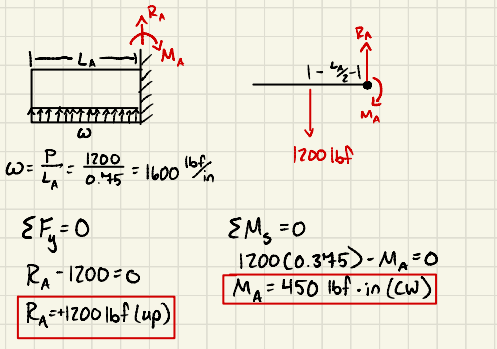

Figure 1. Feature A modeled as a cantilever with a uniformly distributed strap load. The diagram identifies the exposed length, applied load, support force, and reaction moment.

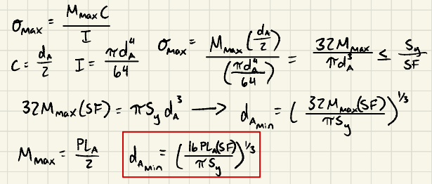

Figure 2. Derivation of the minimum solid-cylinder diameter using bending stress and the allowable stress for A36 steel.

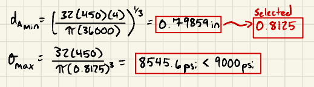

Figure 3. Numerical calculation of Feature A’s minimum diameter and verification of the selected 0.8125-inch basic diameter.

The minimum diameter is 0.79859 in. A basic diameter of 0.8125 in was selected.

At a diameter of 0.8125 in, the bending stress is 8545.6 psi, below the allowable 9000 psi.

The later RC3 fit sets the finished mating diameter at 0.8112–0.8117 in. Its minimum diameter remains above the calculated stress minimum for the original strap-load model.

### Feature B — Connecting Bar

Feature B carries an axial tensile load of 1200 lbf.

Known values:

- Axial load: 1200 lbf.
- Selected width: 0.8125 in.
- Allowable stress: 9000 psi.

The unknowns are the minimum cross-sectional area and thickness.

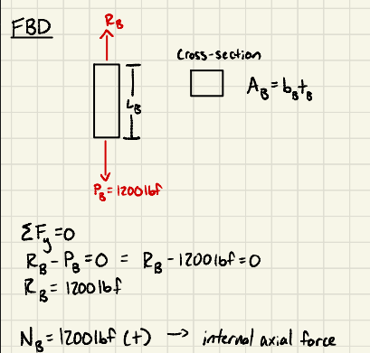

Figure 4. Feature B modeled as an axially loaded bar carrying 1200 lbf in tension, following Appendix D.

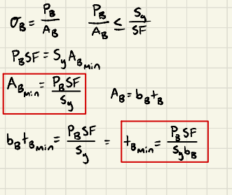

Figure 5. Derivation of the required cross-sectional area and bar thickness from the axial normal-stress equation.

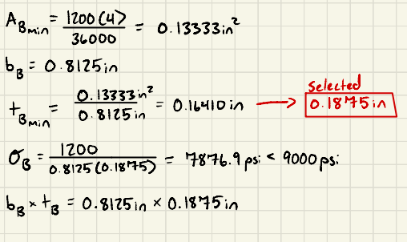

Figure 6. Numerical calculation of Feature B’s minimum thickness and axial-stress check for the selected 0.1875-inch thickness.

The minimum area is 0.13333 in². With a width of 0.8125 in, the minimum thickness is 0.16410 in.

A thickness of 0.1875 in was selected. The calculated axial stress is 7876.9 psi.

A clear length of 1.000 in was selected for the stiffness calculation.

### Feature C — Bottom Horizontal Member

Feature C carries a centered load of 1200 lbf. Each support reaction is 600 lbf.

Known values:

- Center load: 1200 lbf.
- Support-centerline span: 2.750 in.
- Depth into the page: 1.000 in.
- Allowable stress: 9000 psi.

The unknown is the minimum vertical thickness.

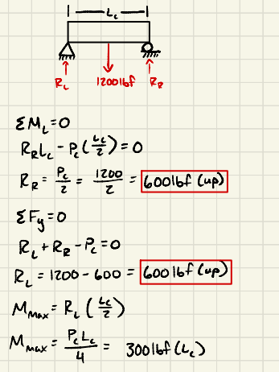

Figure 7. Feature C modeled as a simply supported beam with a centered 1200 lbf load and two 600 lbf support reactions.

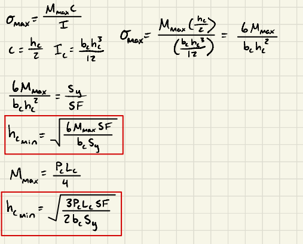

Figure 8. Derivation of Feature C’s required vertical thickness using the maximum bending moment and a rectangular cross section.

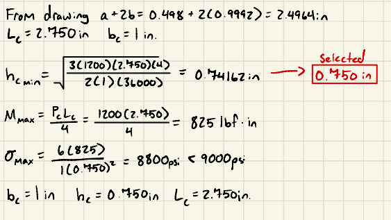

Figure 9. Numerical calculation of Feature C’s minimum thickness and bending-stress check for the selected 0.750-inch thickness.

The maximum bending moment is 825 lbf-in.

The minimum vertical thickness is 0.74162 in. A thickness of 0.750 in was selected.

The calculated bending stress is 8800 psi.

### Feature D — Side Members

Each side member carries an axial tensile load of 600 lbf.

Known values:

- Load per side: 600 lbf.
- Depth into the page: 1.000 in.
- Allowable stress: 9000 psi.

The unknowns are the minimum cross-sectional area and side-wall thickness.

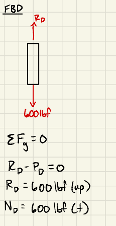

Figure 10. One of the two symmetric side members modeled under a centered axial tensile load of 600 lbf.

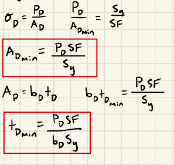

Figure 11. Derivation of the required cross-sectional area and side-wall thickness using the axial normal-stress equation.

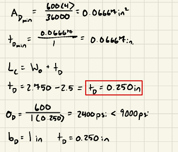

Figure 12. Numerical calculation of Feature D’s minimum thickness and stress verification for the selected 0.250-inch wall thickness.

The minimum required area is 0.066667 in². With a depth of 1.000 in, the minimum thickness is 0.066667 in.

A thickness of 0.250 in was selected to maintain the bracket geometry and Feature C’s support span.

The calculated axial stress is 2400 psi. The nominal clear height is 1.500 in.

### Feature E — Upper Retaining Lips

Each lip carries an upward contact force of 600 lbf.

Known values:

- Contact load per lip: 600 lbf.
- Inward projection: 1.000 in.
- Depth into the page: 1.000 in.
- Allowable stress: 9000 psi.

The unknown is the minimum vertical lip thickness.

The contact force is conservatively placed at the free edge.

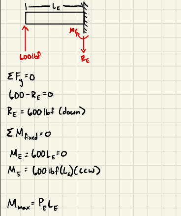

Figure 13. The right-hand retaining lip modeled as a cantilever with a 600 lbf upward contact force concentrated at its free edge.

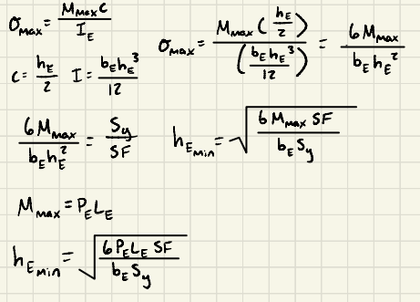

Figure 14. Derivation of the minimum lip thickness using cantilever bending stress and a rectangular cross section.

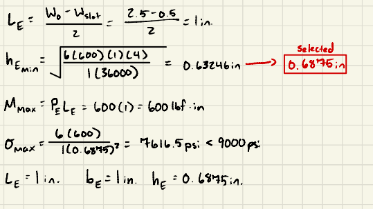

Figure 15. Numerical calculation of Feature E’s minimum thickness and bending-stress check for the selected 0.6875-inch thickness.

The maximum bending moment is 600 lbf-in.

The minimum vertical thickness is 0.63246 in. A thickness of 0.6875 in was selected.

The calculated bending stress is 7616.5 psi.

## Stiffness Analysis

The allowable deflection is 0.005 in for each feature.

The actual applied loads were used without multiplying them by the stress safety factor. The elastic modulus used throughout was 29000000 psi.

### Feature A — Cylinder Deflection

The loading and exposed length are unchanged from the stress calculation.

The unknown is the minimum cylinder diameter required by bending stiffness.

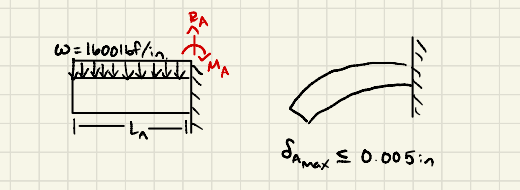

Figure 16. Feature A’s distributed-load FBD and deflected shape, showing maximum displacement at the cylinder’s free end.

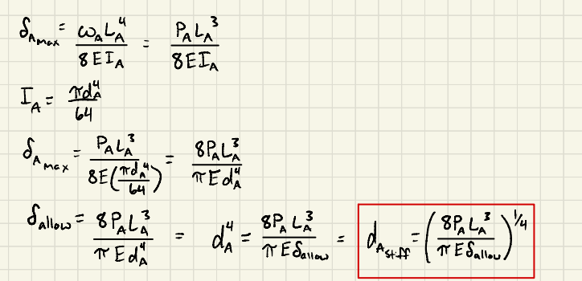

Figure 17. Derivation of the minimum cylinder diameter from the deflection equation for a uniformly loaded cantilever.

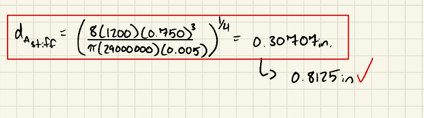

Figure 18. Numerical calculation of the stiffness-based diameter and verification that the selected basic diameter satisfies the 0.005-inch deflection limit.

The minimum diameter required by stiffness is 0.30707 in.

At the selected basic diameter of 0.8125 in, the calculated free-end deflection is 0.00010200 in.

Bending stress requires the larger diameter.

### Feature B — Axial Elongation

The calculation uses a tensile load of 1200 lbf, a clear length of 1.000 in, and a width of 0.8125 in.

The unknown is the minimum thickness required by axial stiffness.

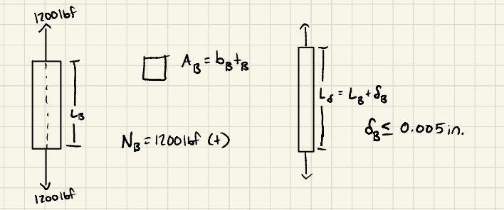

Figure 19. Feature B’s axial-load FBD and deformation sketch, identifying its 1.000-inch clear length and tensile elongation.

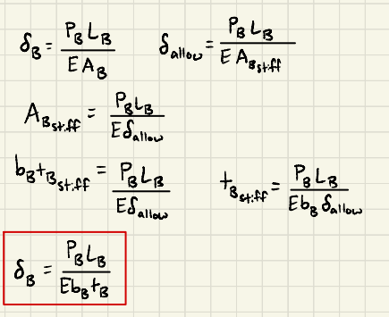

Figure 20. Derivation of the minimum area and thickness from the axial-elongation equation.

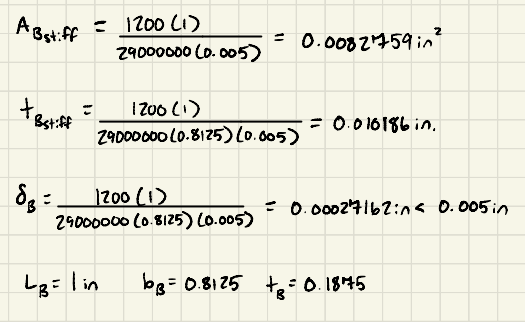

Figure 21. Numerical calculation of Feature B’s stiffness-based thickness and elongation at the selected stress-based dimensions.

The minimum thickness required by axial stiffness is 0.010186 in.

At the selected thickness of 0.1875 in, the calculated elongation is 0.00027162 in.

Axial stress requires the larger thickness.

### Feature C — Midspan Deflection

The calculation uses a centered load of 1200 lbf, a span of 2.750 in, and a depth of 1.000 in.

The unknown is the minimum vertical thickness required by bending stiffness.

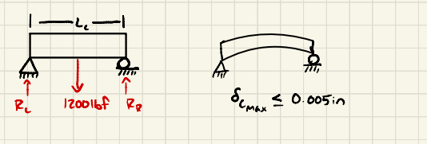

Figure 22. Feature C’s centered-load FBD and symmetric deflected shape, with maximum displacement at midspan.

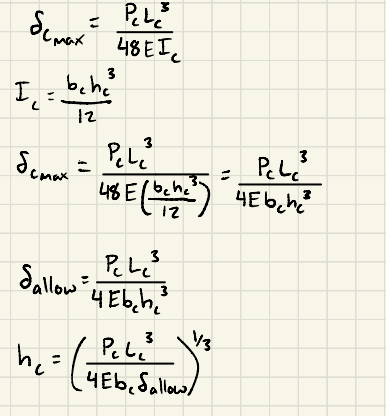

Figure 23. Derivation of Feature C’s minimum thickness from the deflection equation for a simply supported beam with a centered point load.

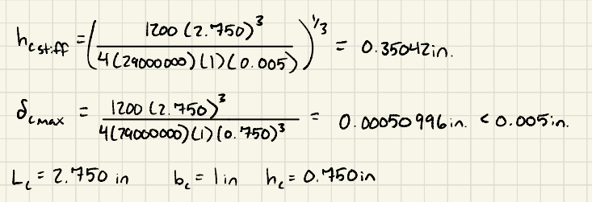

Figure 24. Numerical calculation of Feature C’s stiffness-based thickness and deflection at the selected 0.750-inch thickness.

The minimum thickness required by stiffness is 0.35042 in.

At the selected thickness of 0.750 in, the calculated center deflection is 0.00050996 in.

Bending stress requires the larger thickness.

### Feature D — Side-Member Elongation

Each side carries 600 lbf over a nominal clear length of 1.500 in. The depth is 1.000 in.

The unknown is the minimum wall thickness required by axial stiffness.

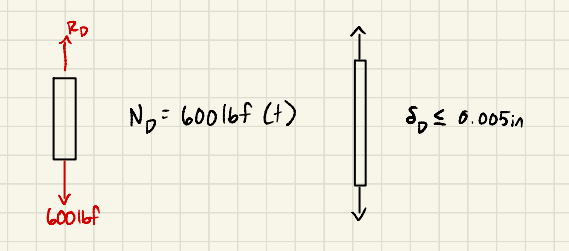

Figure 25. One side member’s axial-load FBD and elongation sketch, showing the 600 lbf load and 1.500-inch nominal clear length.

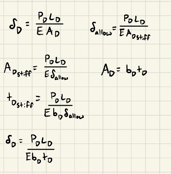

Figure 26. Derivation of Feature D’s minimum area and thickness from the allowable axial elongation.

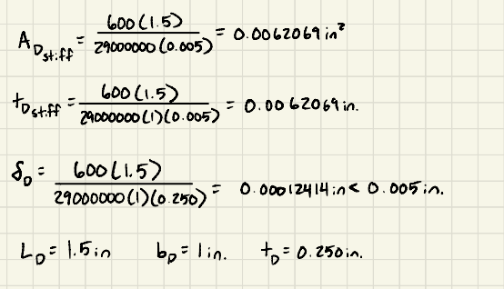

Figure 27. Numerical calculation of Feature D’s stiffness minimum and elongation check for the retained 0.250-inch wall thickness.

The minimum thickness required by axial stiffness is 0.0062069 in.

At the selected thickness of 0.250 in, the calculated elongation is 0.00012414 in.

Axial stress requires a larger minimum than stiffness, but the selected thickness is controlled by the chosen bracket geometry.

### Feature E — Lip Deflection

Each lip carries a 600 lbf end load over a 1.000-inch projection. The depth is 1.000 in.

The unknown is the minimum lip thickness required by bending stiffness.

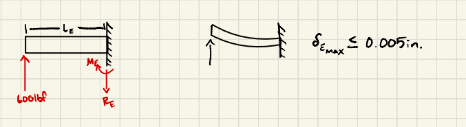

Figure 28. Feature E’s end-load FBD and deflected shape, showing upward displacement at the lip’s free edge.

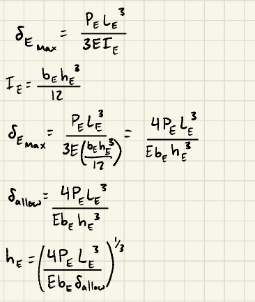

Figure 29. Derivation of the minimum lip thickness from the cantilever end-load deflection equation.

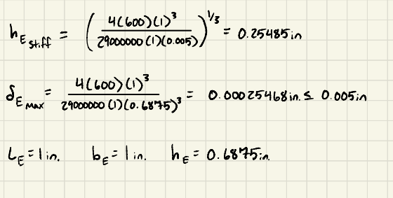

Figure 30. Numerical calculation of Feature E’s stiffness-based thickness and deflection at the selected 0.6875-inch thickness.

The minimum thickness required by stiffness is 0.25485 in.

At the selected thickness of 0.6875 in, the calculated free-edge deflection is 0.00025468 in.

Bending stress requires the larger thickness.

## Decide

### Selected Stress-Based Dimensions

All dimensions below are in inches.

- Feature A: 0.8125 basic diameter and 0.750 exposed length.
- Feature B: 0.8125 width, 0.1875 thickness, and 1.000 clear length.
- Feature C: 0.750 vertical thickness and 1.000 depth.
- Feature C analysis span: 2.750 between side-wall centerlines.
- Feature D: 0.250 thickness, 1.500 nominal clear height, and 1.000 depth.
- Feature E: 1.000 nominal inward projection, 0.6875 vertical thickness, and 1.000 depth.

The upper bracket has a nominal overall width of 3.000 in, height of 2.9375 in, and depth of 1.000 in.

For the drawing arrangement in which A extends through B and ends flush with its back face, A’s total length is 0.9375 in. Its unsupported exposed length remains 0.750 in.

### Stiffness-Based Drawing Dimensions

The stiffness-only dimensions were rounded upward for the separate comparison drawing.

- Feature A diameter: 0.308 in.
- Feature A exposed length: 0.750 in.
- Feature B width: 0.8125 in.
- Feature B thickness: 0.011 in.
- Feature B clear length: 1.000 in.
- Feature C vertical thickness: 0.351 in.
- Feature C depth: 1.000 in.
- Feature D thickness: 0.250 in.
- Feature D nominal clear height: 1.500 in.
- Feature D depth: 1.000 in.
- Feature E vertical thickness: 0.255 in.
- Feature E nominal projection: 1.000 in.
- Feature E depth: 1.000 in.

D’s thickness was retained to preserve the opening geometry and C’s support span. Its calculated axial-stiffness minimum is identified separately on the drawing.

The stiffness-based upper bracket has a nominal overall width of 3.000 in and height of 2.106 in.

These reduced dimensions are for stiffness comparison only and do not satisfy the stress requirements.

### Bracket Fits

#### Dimension a — RC7

RC7 was selected because the assignment states that accuracy is not essential.

- T-beam stem limits: 0.4970–0.4980 in.
- Bracket slot limits: 0.5000–0.5016 in.
- Minimum total width clearance: 0.0020 in.
- Maximum total width clearance: 0.0046 in.

Source: Machinery’s Handbook, Table 8b, page 655.

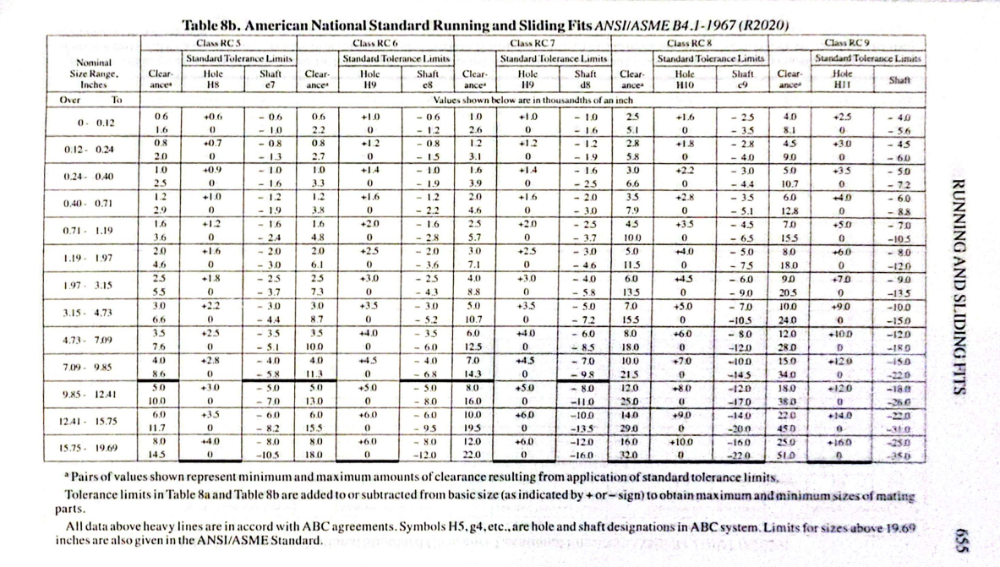

Figure 31. RC7 limits for the bracket’s stem slot and verification of minimum and maximum width clearance.

#### Dimension b — RC3

RC3 was selected because the assignment describes the closest fit expected to run freely.

- External flange-projection limits: 0.9987–0.9992 in.
- Corresponding bracket-recess limits: 1.0000–1.0008 in.
- Minimum dimensional clearance: 0.0008 in.
- Maximum dimensional clearance: 0.0021 in.

The full flange-opening width, obtained by adding the stem slot and both side recesses, ranges from 2.5000 to 2.5032 in.

Actual side gaps also depend on the T-beam’s lateral position within the stem-slot clearance.

Source: Machinery’s Handbook, Table 8a, page 654.

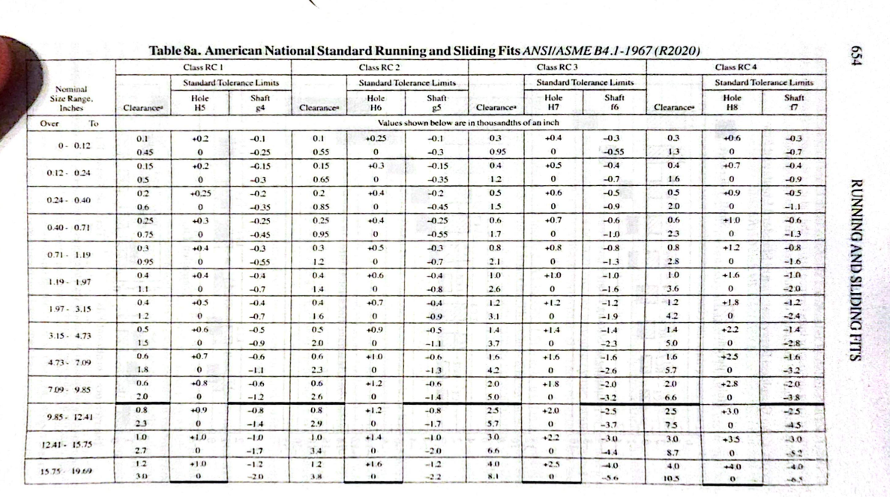

Figure 32. Table with RC3 limits for each side recess and the resulting tolerance stack for the total flange-opening width.

#### Dimension c — RC4

RC4 was selected for accurate location with minimum play.

- T-beam flange-thickness limits: 1.4980–1.4990 in.
- Bracket opening-height limits: 1.5000–1.5016 in.
- Minimum total vertical clearance: 0.0010 in.
- Maximum total vertical clearance: 0.0036 in.

Source: Machinery’s Handbook, Table 8a, page 654.

(Refer to Figure 32 for RC 4 fit)

The structural calculations use nominal geometry. The fit limits define the permitted variation of the mating dimensions.

## Link Design

### Geometry, Loading, and Assumptions

The link connects Feature A to a nominal 1-inch shaft.

A36 steel was selected, and the single link carries 1200 lbf in axial tension. The allowable nominal stress is 9000 psi.

The selected dimensions are:

- Overall length: 3.750 in.
- Overall width: 1.750 in.
- Thickness: 0.250 in.
- Hole-center spacing: 2.000 in.
- End radii: 0.875 in.

The load acts along the line joining the hole centers. The plate has uniform thickness, and the nominal net-section calculation excludes local stress concentrations, bearing stresses, and interference-fit stresses.

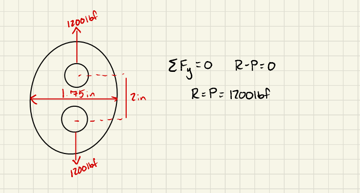

Figure 34. Link FBD showing opposing 1200 lbf forces acting along the line joining the hole centers.

### Net-Section Strength

The cross section through the larger hole controls the nominal net-section stress.

The required net area is 0.13333 in².

A width of 1.750 in and a thickness of 0.250 in were selected. Using a preliminary 1.000-inch hole gives a net area of 0.1875 in² and a nominal stress of 6400 psi.

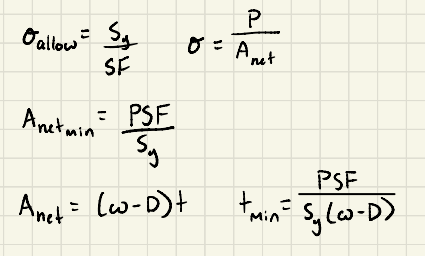

Figure 35. Derivation of the required net area and plate thickness at the larger hole.

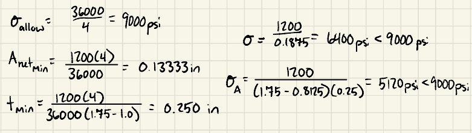

Figure 36. Selection of the link width and thickness and verification of nominal net-section tensile stress using preliminary hole dimensions.

### Axial Elongation

The minimum net area was applied over the entire 2.000-inch hole-center spacing for the simplified axial calculation.

The assumed allowable elongation is 0.005 in, consistent with the bracket’s individual-feature limit.

Using the preliminary net area of 0.1875 in² gives an elongation of 0.00044138 in.

This model excludes local hole-contact deformation.

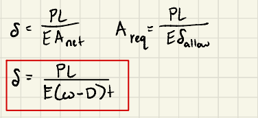

Figure 37. Axial-elongation model using the minimum net area over the hole-center spacing.

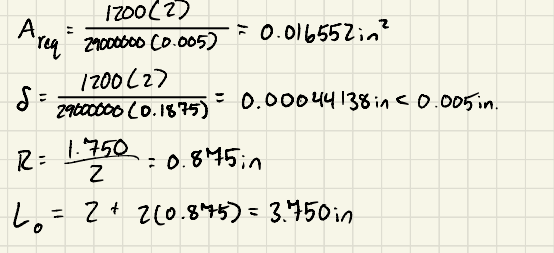

Figure 38. Elongation calculation for the selected 2.000-inch hole-center spacing and preliminary net cross-sectional area.

### Feature A Connection — RC3 Fit

RC3 provides a close clearance fit allowing relative movement between the link and Feature A.

- Basic size: 0.8125 in.
- Link-hole limits: 0.8125–0.8133 in.
- Feature A shaft limits: 0.8112–0.8117 in.
- Minimum diametral clearance: 0.0008 in.
- Maximum diametral clearance: 0.0021 in.

Source: Machinery’s Handbook, Table 8a, page 654.

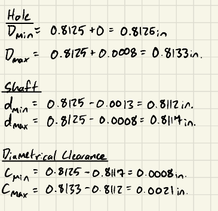

Figure 39. RC3 hole and shaft limits for the Feature A connection, including minimum and maximum diametral clearance.

### RC3 Manufacturing Method

The proposed hole-making process is drilling undersize followed by finish reaming.

The plate would be supported on a backing plate during machining. After finishing, the hole would be lightly deburred and inspected with suitable plug gauges or a calibrated bore-measuring instrument.

Feature A’s mating surface would be precision turned and checked with an outside micrometer at multiple axial positions and angular orientations.

The proposed processes must be verified to achieve the specified limits. Nominal tool size alone does not guarantee the finished fit.

### 1-Inch Shaft Connection — FN1 Fit

FN1 was selected to meet the requirement for light assembly pressure.

- Basic size: 1.0000 in.
- Link-hole limits: 1.0000–1.0005 in.
- Shaft limits: 1.0008–1.0012 in.
- Minimum diametral interference: 0.0003 in.
- Maximum diametral interference: 0.0012 in.

The shaft must be manufactured to these limits. An exactly 1.0000-inch shaft would not produce the specified interference fit.

Source: Machinery’s Handbook, Table 11, page 659.

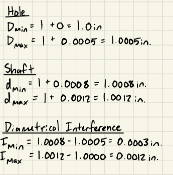

Figure 40. FN1 hole and shaft limits for the nominal 1-inch connection, including minimum and maximum diametral interference.

### FN1 Manufacturing and Assembly Method

The link hole would be drilled undersize and precision bored to its final limits.

The shaft would be precision turned, with cylindrical grinding if needed to achieve the specified size and geometry.

Both parts would be inspected before assembly. The plate would be supported close to the hole, and the shaft would be aligned perpendicular to the plate.

An arbor or hydraulic press would apply controlled axial pressure. After assembly, the link would be inspected for distortion, including a check of the adjacent RC3 hole.

The fit table establishes dimensional limits. It does not establish the required pressing force or verify machining-process capability.

### Final Link Checks

The maximum finished diameter of the larger hole is 1.0005 in.

With the selected nominal width and thickness, the minimum net area is 0.187375 in².

The updated nominal tensile stress is 6404.3 psi, below the allowable 9000 psi.

The updated axial elongation is 0.00044167 in, below the assumed 0.005-inch limit.

These checks use the preassembly hole size and exclude stresses introduced by the interference fit.

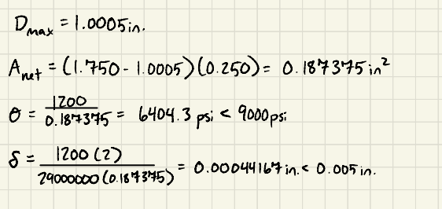

Figure 41. Updated net-section stress and axial-elongation checks using the maximum finished-hole diameter of 1.0005 inches.

### Fit Tables Used

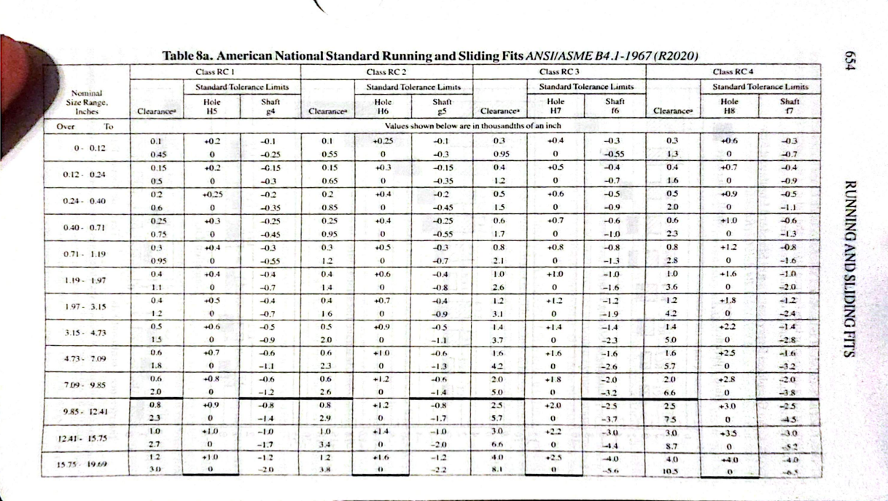

Figure 42. Machinery’s Handbook, Table 8a, page 654. RC3 and RC4 tolerance limits used for the bracket and link.

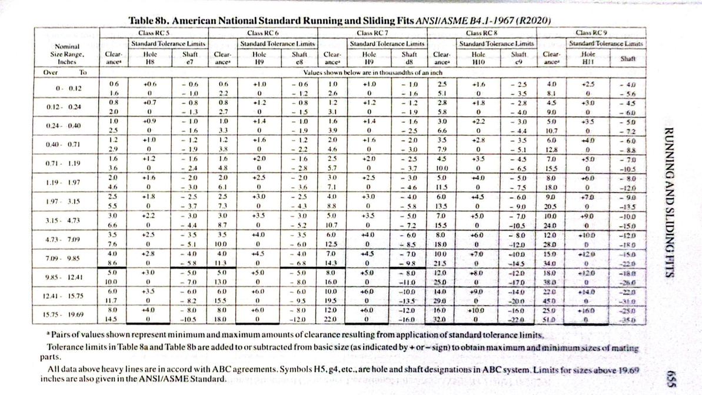

Figure 43. Machinery’s Handbook, Table 8b, page 655. RC7 tolerance limits used for the bracket’s stem slot.

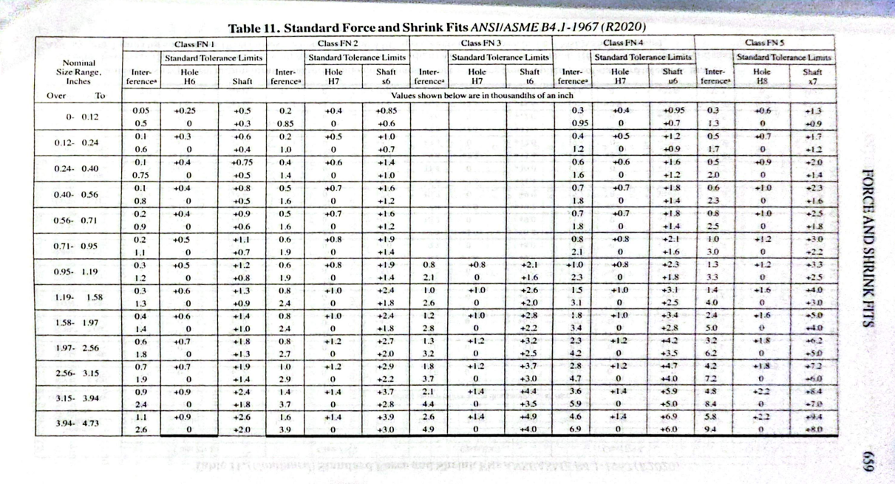

Figure 44. Machinery’s Handbook, Table 11, page 659. FN1 tolerance limits used for the link’s nominal 1-inch shaft connection.

## Communicate

### Stress-Based Multiview Drawing

The paper drawing shows the selected stress-based dimensions in aligned front, top, and right-side views.

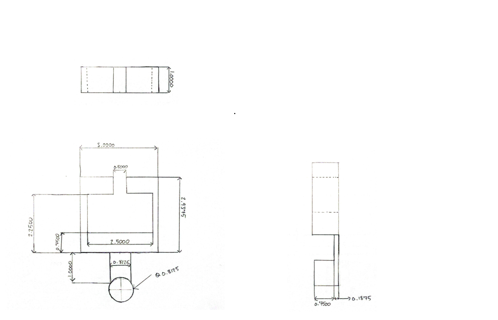

Figure 45. Dimensioned front, top, and right-side views of the bracket using the selected stress-based dimensions.

### Stiffness-Based Multiview Drawing

The separate paper drawing shows the stiffness-based comparison dimensions.

Feature D retains its selected thickness to preserve the bracket geometry and the support span used for Feature C.

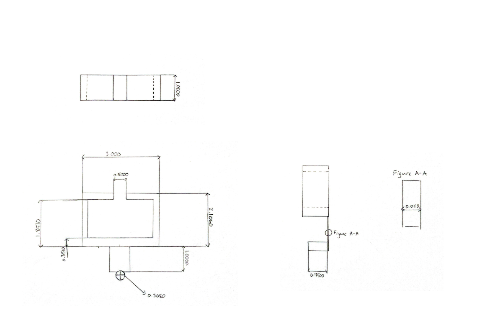

Figure 46. Separate multiview drawing using stiffness-based dimensions, with Feature D’s wall thickness retained for geometric compatibility.

## Lessons Learned

### Governing Requirement

Feature C required a minimum thickness of 0.74162 in from stress and 0.35042 in from stiffness. The difference was approximately 0.39120 in.

Bending stress governed the selected thickness of 0.750 in.

At this thickness, the calculated stress was 8800 psi and the deflection was 0.00050996 in. Both were within the limits of the simplified model.

The stiffness requirement alone would have allowed a thinner member, but that member would not have satisfied the allowable bending stress.

### Error Propagation

Feature D’s thickness determines the location of Feature C’s support centerlines.

A 2.500-inch opening and two 0.250-inch side walls give a support-centerline span of 2.750 in.

Replacing the side-wall thickness with its stiffness minimum of 0.0062069 in would change the span to 2.5062069 in. The previous calculations for C would then no longer describe the revised geometry.

This inconsistency was identified when preparing the stiffness drawing. Retaining D’s selected thickness preserved the span used in C’s calculations.

The check demonstrated that changing one feature can change another feature’s analysis inputs.

### Assumption Sensitivity

Feature A was analyzed with the strap load uniformly distributed over its exposed length.

That model produced a maximum bending moment of 450 lbf-in. Concentrating the same load at the free end would increase the moment to 900 lbf-in.

The required diameter would increase from 0.79859 in to approximately 1.0062 in, an increase of about 26%.

This demonstrates that the assumed load location and distribution directly affect the required dimensions.

### Model Limitations

The analysis follows the assignment’s simplified feature models.

The axial-only calculations for B and D omit connection moments. Local stress concentrations, bearing stresses, and interference-fit stresses were not included in the nominal sizing calculations.

These assumptions must remain visible when interpreting the results.

## Time Spent

- Stress calculations: 4 hours
- Stiffness calculations: 3.5 hours
- Fits and link design: 2 hours 
- Paper drawings: 2 hours
- Portfolio preparation: 4 hours
- Total time: 15.5 hours

## References

1. MEGR 2156, Design for Strength and Stiffness I assignment handout. Project requirements, feature definitions, and modeling guidance in Appendices A–E.

2. Machinery’s Handbook. Table 8a, American National Standard Running and Sliding Fits, page 654. RC3 and RC4 tolerance limits.

3. Machinery’s Handbook. Table 8b, American National Standard Running and Sliding Fits, page 655. RC7 tolerance limits.

4. Machinery’s Handbook. Table 11, Standard Force and Shrink Fits, page 659. FN1 tolerance limits.

5. [ULINE — Heavy Duty Polyester Cord Strapping, S-12925](https://www.uline.com/Product/Detail/S-12925/Poly-Cord-Strapping/Heavy-Duty-Polyester-Cord-Strapping-3-4-x-2500). Strap dimensions.

6. [SSAB — ASTM A36](https://www.ssab.com/en-us/brands-and-products/commercial-steel/structural-steel/astm-a36). Minimum yield-strength reference.

7. [Sandvik Coromant — High Performance Precision Reaming](https://news.cision.com/sandvik-coromant-/r/high-performance-precision-reaming-with-new-cororeamer-435-and-835,c9303463). General support for reaming as a close-tolerance hole-finishing process.
