# A6 — Design for Strength and Stiffness II

## Objective

Create parametric CAD models and engineering drawings of the bracket and link developed in the previous assignment. Use an analytical equation to control a bracket dimension, specify the required mating fits, and communicate the design through dimensioned drawings.

## Analyze

### Previous Design Results

The models use dimensions selected from the previous strength and stiffness analyses.

- Material specified: ASTM A36 steel
- Strap tension: 600 lbf per leg
- Total bracket load: 1200 lbf
- Safety factor: 4
- Yield strength used in calculations: 36000 psi
- Elastic modulus used in calculations: 29000000 psi

The bracket was divided into features A through E. The CAD model follows the simplified geometry and loading assumptions used in those calculations.

### Bracket Modeling Process

The bracket was created in Fusion using named parameters for the T-slot, upper block, support B, and cylinder A. Expressions connected related dimensions so changes could be made through the model.

#### Upper Block Sketch

The first sketch defined the rectangular outline of the upper block. Its width was controlled by bracket_width, and its height was controlled by bracket_height.

The width was 3.000 in. The height was 2.9375 in at the original load and included the bottom thickness, opening height, and upper lip thickness.

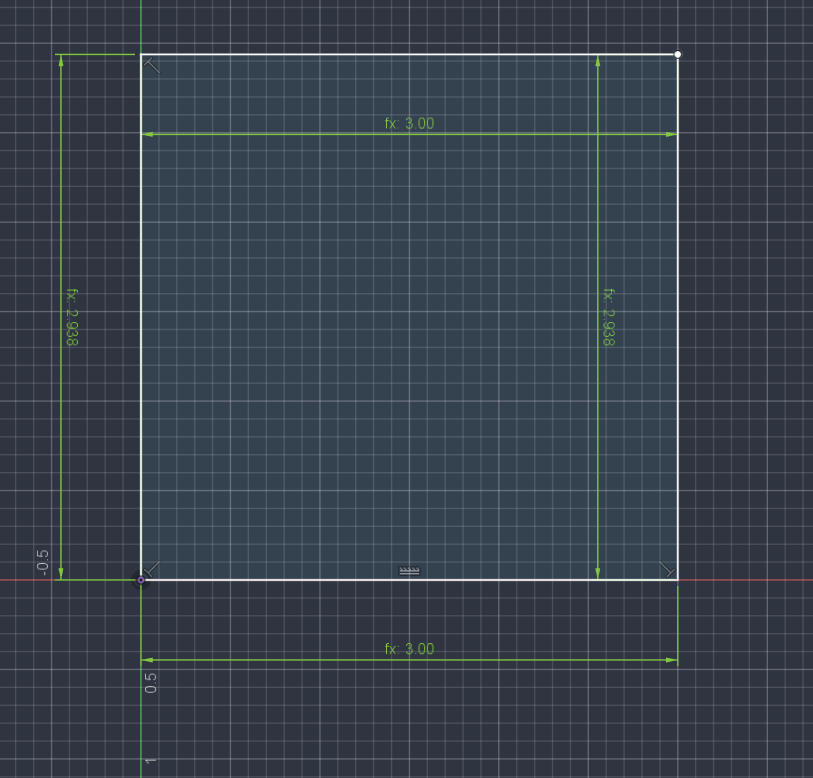

*Figure 1. Upper block sketch showing the overall width and height controlled by named parameters.*

#### Upper Block Extrusion

The rectangular profile was extruded using bracket_depth, producing a block 1.000 in deep. This solid provided the starting geometry for the T-shaped opening.

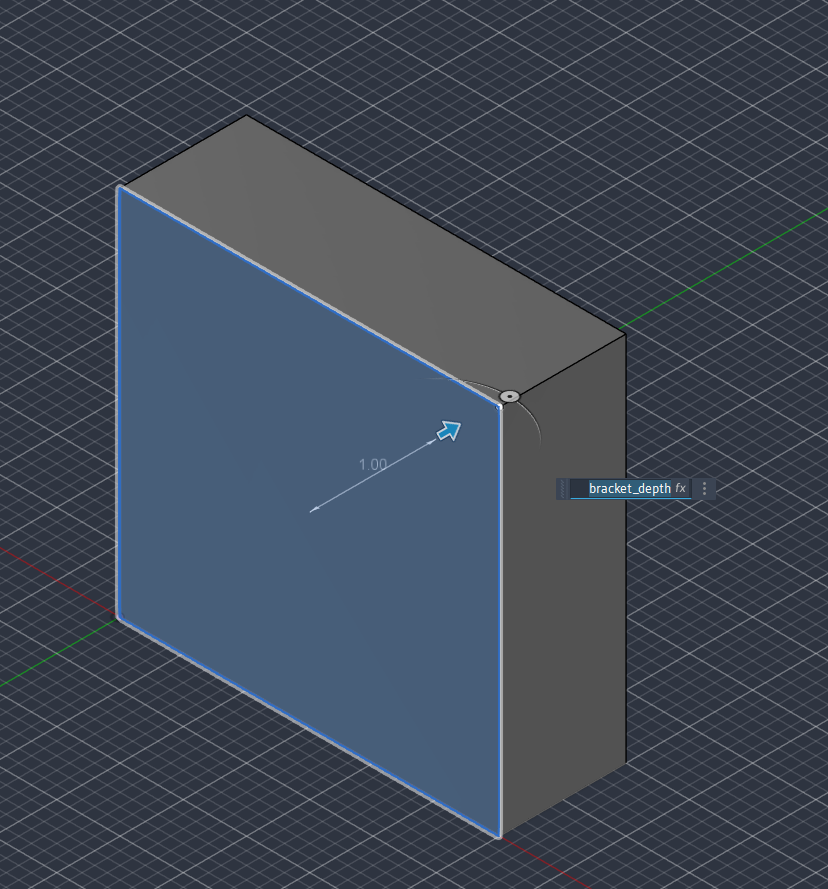

*Figure 2. Extrusion of the upper block to a depth of 1.000 in.*

#### Wide Opening Sketch

A rectangular opening was sketched on the front face of the block. The opening was 2.500 in wide and 1.500 in high.

Its bottom edge was positioned 0.750 in above the bottom of the block. The opening was centered horizontally, leaving a nominal wall thickness of 0.250 in on each side.

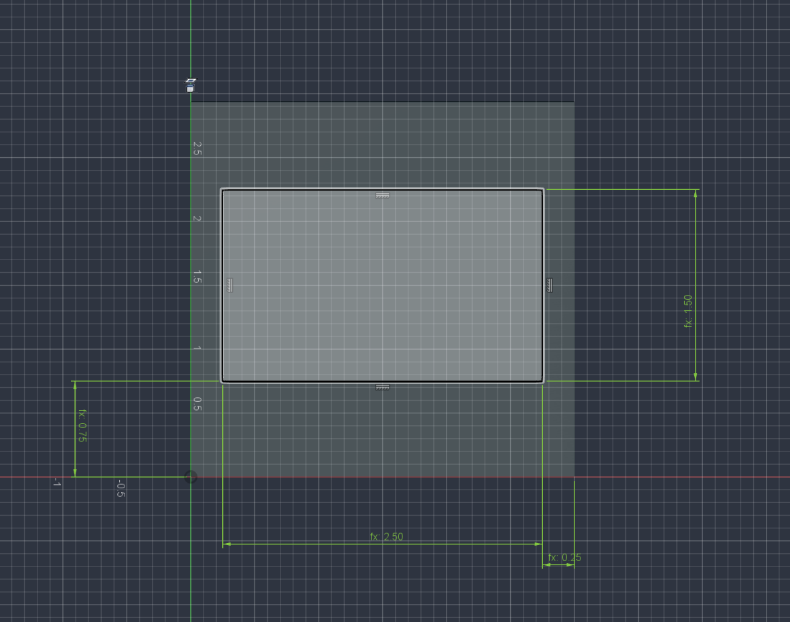

*Figure 3. Wide opening sketch showing its dimensions and location within the upper block.*

#### Wide Opening Cut

The rectangular opening was cut through the full depth of the block. This created the space for the horizontal portion of the rigid T-beam.

The remaining material below the opening formed feature C. Its thickness was controlled by the parameter relationship discussed below.

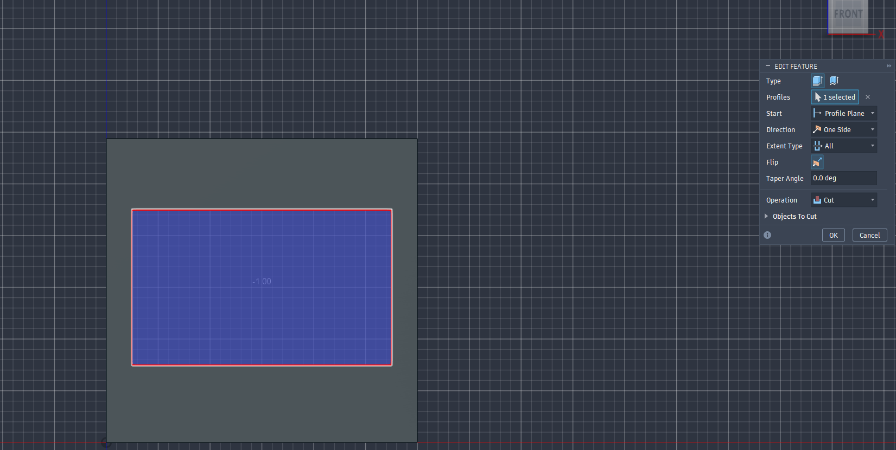

*Figure 4. Through-cut forming the wide portion of the T-beam opening.*

#### Narrow Slot Sketch

A second sketch defined the narrow opening through the upper lip. The slot was centered across the block and had a basic width of 0.5000 in.

The sketch extended from the top of the wide opening to the top surface of the block.

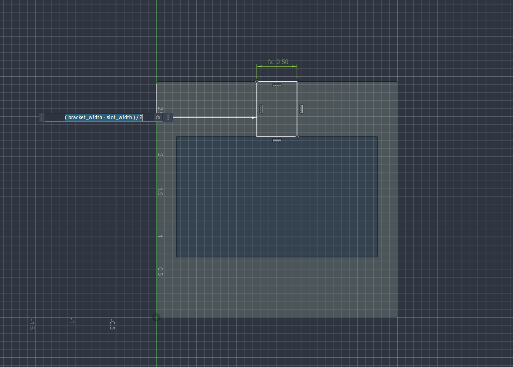

*Figure 5. Centered narrow-slot sketch connecting the wide opening to the top of the bracket.*

#### Narrow Slot Cut

The narrow profile was cut through the full block depth. This completed the T-shaped opening and separated the upper portion into two lips.

The exact geometry was modeled first. The specific RC7, RC3, and RC4 fit tolerances were applied to the engineering drawing.

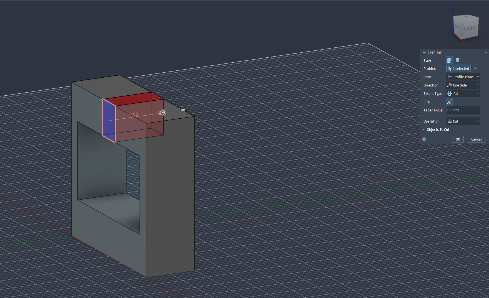

*Figure 6. Completed T-shaped opening after cutting the narrow slot through the block.*

#### Support B Sketch

Support B was sketched on the rear face of the bracket. The rectangular support was centered beneath the upper block.

Its width was 0.8125 in. Its total modeled length was 1.40625 in, consisting of the 1.000 in clear gap plus half of the cylinder diameter. This positioned the support’s lower edge at the cylinder center.

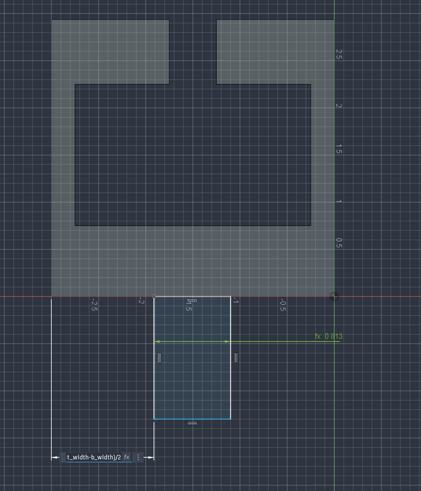

*Figure 7. Rear-face sketch defining the width, length, and centered position of support B.*

#### Support B Extrusion

The support profile was extruded 0.1875 in toward the front of the bracket using a Join operation.

This kept the support’s rear face flush with the rear face of the upper block and connected the support to feature C.

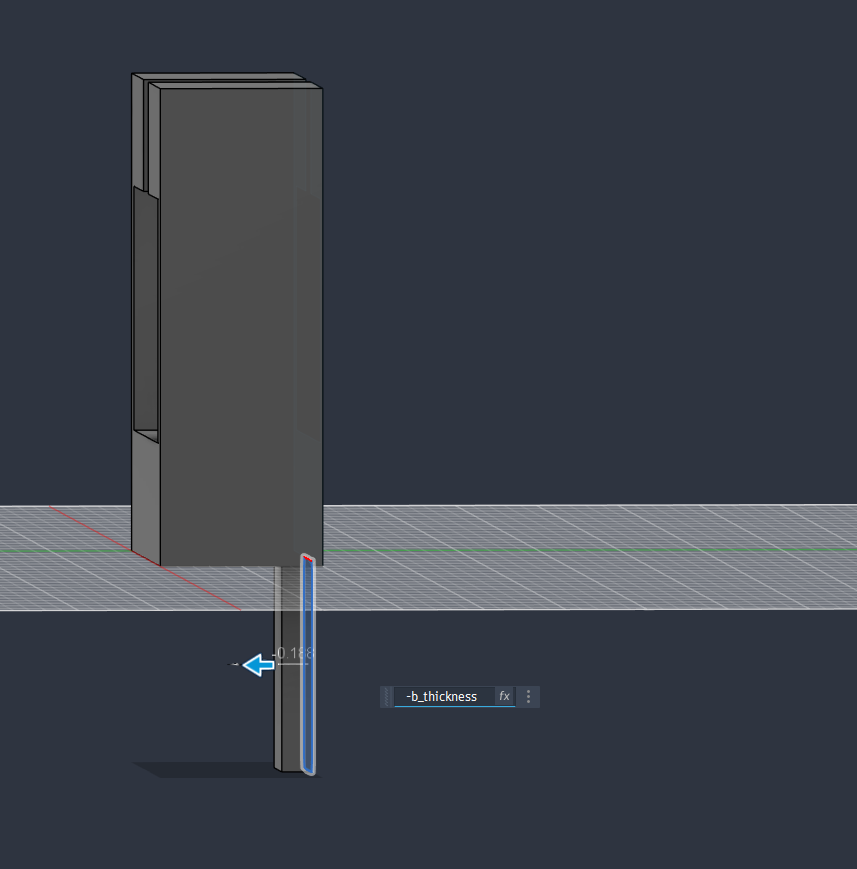

*Figure 8. Joined extrusion forming support B with a thickness of 0.1875 in.*

#### Cylinder A Sketch

A circular profile was sketched on the rear face of support B. Its center was located at the midpoint of the support’s lower edge.

The basic diameter was controlled by a_diameter and set to 0.8125 in. Positioning the circle this way allowed its upper portion to overlap support B.

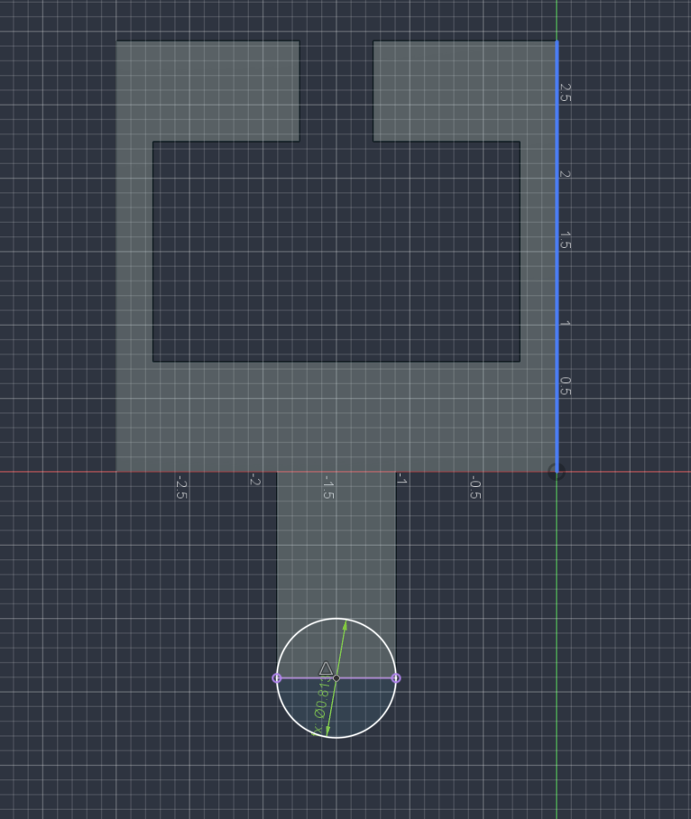

*Figure 9. Cylinder sketch showing its basic diameter and location at the lower end of support B.*

#### Cylinder A Extrusion

The circle was extruded toward the front using a Join operation. The total extrusion length was 0.9375 in.

This length included the 0.1875 in support thickness and left 0.750 in of exposed cylinder in front of support B. The rear end of the cylinder remained flush with the bracket’s rear face.

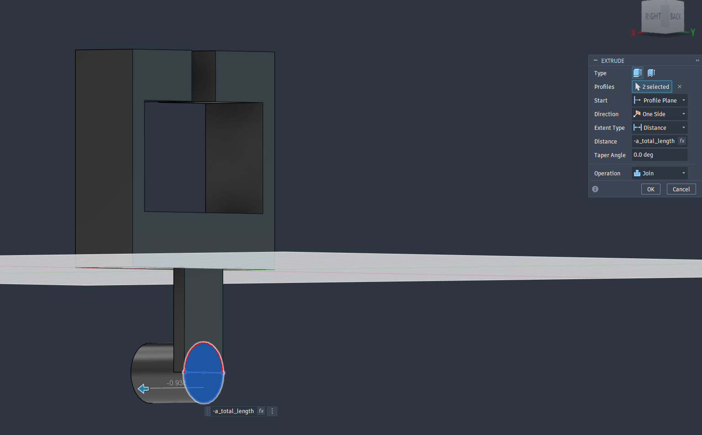

*Figure 10. Joined cylinder extrusion showing the exposed strap-supporting length.*

#### Completed Bracket

The completed bracket contained the T-shaped opening, support B, and cylinder A. The model followed the feature geometry used in the previous stress and stiffness calculations.

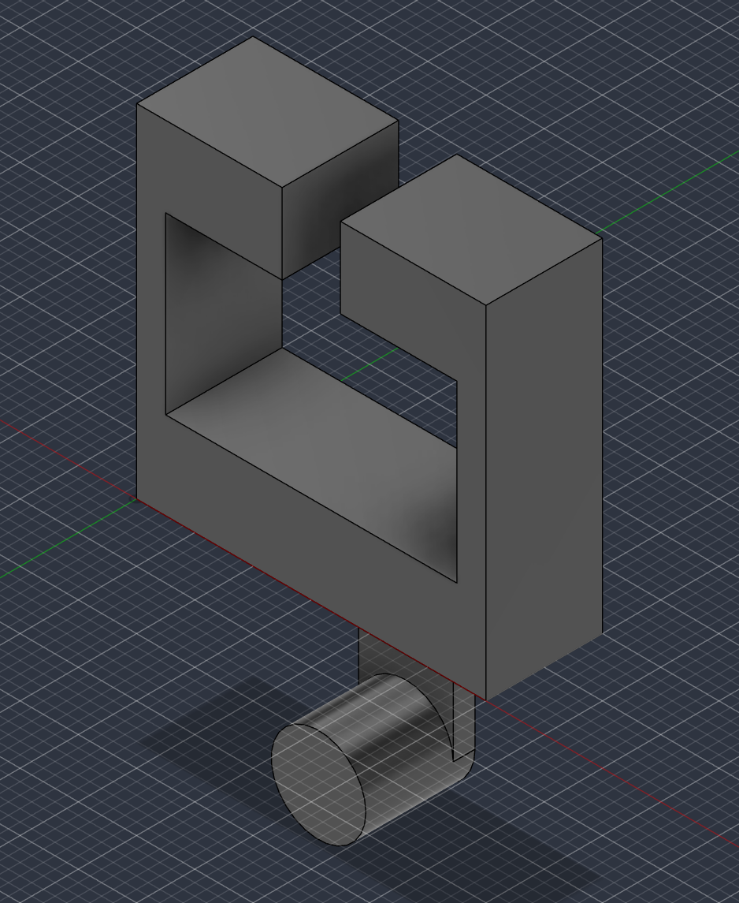

*Figure 11. Completed bracket model before generating the engineering drawing.*

### Equation-Driven Dimension

The bending-stress equation for feature C controlled the parameter c_min_thickness. The bottom_thickness parameter rounded this result upward to the next 0.0625 in increment.

The bracket_height parameter included bottom_thickness, allowing the upper-block height to update when the required thickness changed.

At the original load:

- load_lbf: 1200
- safety_factor: 4
- yield_psi: 36000
- c_span: 2.750 in
- bracket_depth: 1.000 in
- c_min_thickness: 0.74162 in
- bottom_thickness: 0.750 in
- bracket_height: 2.9375 in

The load and yield-strength parameters used unitless numerical entries representing lbf and psi. The expression included the length conversion needed to return a thickness in inches.

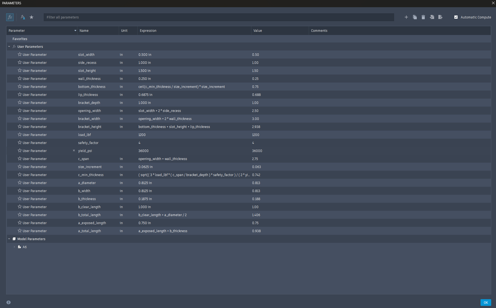

*Figure 12. Parameter table showing the analytical expression and resulting bracket dimensions at 1200 lbf.*

### Parameter Change Check

The total load parameter was temporarily increased from 1200 to 1500 lbf.

The updated values were:

- c_min_thickness: 0.82916 in
- bottom_thickness: 0.875 in
- bracket_height: 3.0625 in

This change increased the thickness of feature C and the overall upper-block height. The load was restored to 1200 lbf before saving the final design.

The check demonstrated the equation based behavior of feature C and its dependent geometry. The other features were not automatically resized or revalidated for the increased load.

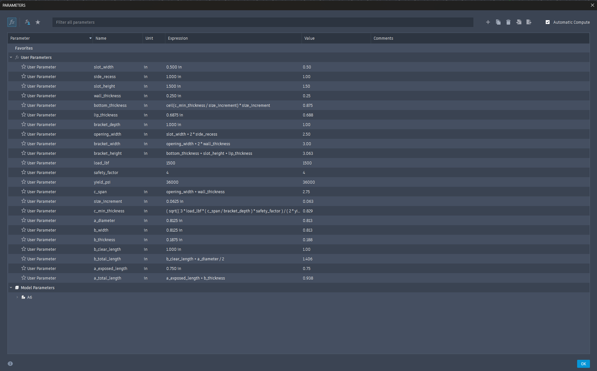

*Figure 13. Parameter change check showing the increased feature C thickness and upper-block height at 1500 lbf.*

### Link Modeling Process

The link was created as a separate internal component in the same Fusion design using the "Hybrid" feature. This allowed the link and bracket to share parameters while having separate engineering drawings.

#### Link Parameters

The link dimensions were defined using named parameters:

- link_width: 1.750 in
- link_thickness: 0.250 in
- link_spacing: 2.000 in
- link_end_radius: 0.875 in
- link_length: 3.750 in
- link_a_hole: a_diameter
- link_shaft_hole: 1.0000 in

Referencing a_diameter tied the upper hole’s basic size to cylinder A. The drawing tolerances established the actual clearance between the manufactured parts.

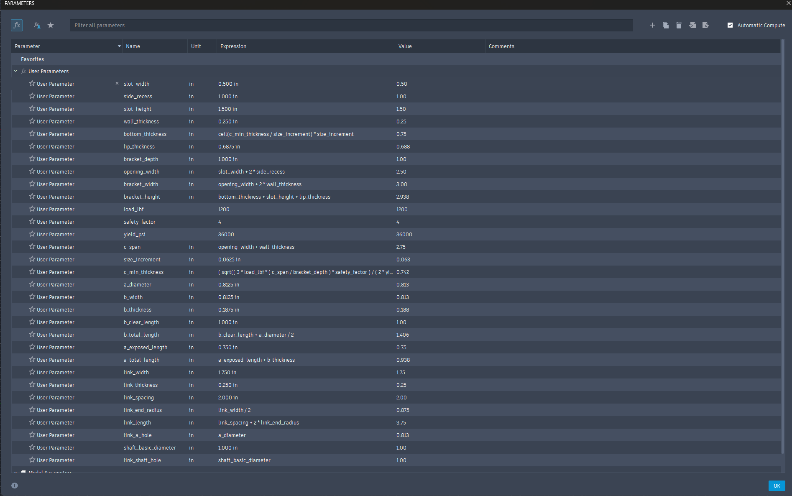

*Figure 14. Link parameters showing the relationship between the upper hole and the bracket’s cylinder diameter.*

#### Link Outline Sketch

A center-to-center slot defined the outside shape of the link. The rounded-end centers were spaced 2.000 in apart, and the profile width was 1.750 in.

Each rounded end had a radius of 0.875 in, producing an overall length of 3.750 in. The profile was aligned vertically, with the lower rounded-end center at the sketch origin.

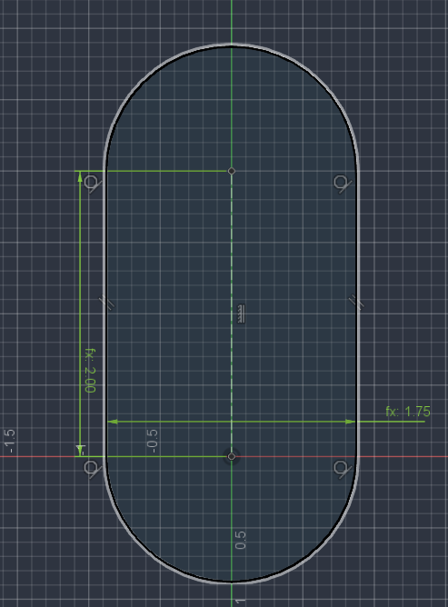

*Figure 15. Link outline sketch showing the width, rounded ends, and center spacing.*

#### Link Plate Extrusion

The closed outline was extruded using link_thickness to create a plate 0.250 in thick.

The extrusion created a new body inside the Link component.

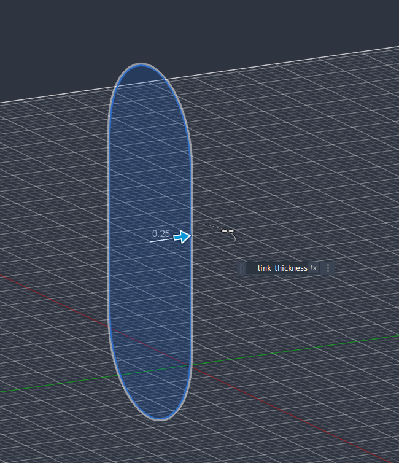

*Figure 16. Extruded link plate before adding the two connection holes.*

#### Link Hole Sketch

Two circles were placed at the centers of the rounded ends.

The upper circle used link_a_hole, giving it a basic diameter of 0.8125 in. The lower circle used link_shaft_hole, giving it a basic diameter of 1.0000 in.

The holes were vertically aligned and spaced 2.000 in center to center.

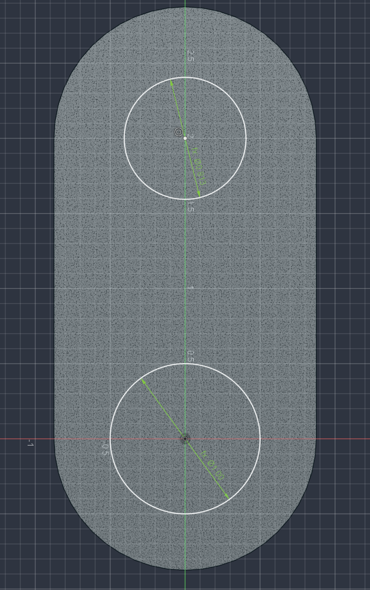

*Figure 17. Hole sketch showing the two basic diameters and their locations at the rounded-end centers.*

#### Link Hole Cut

Both circular profiles were cut through the plate. The cut depth was set to link_thickness, matching the plate extrusion thickness.

Using the same parameter for the extrusion and cut allowed both depths to change together if the plate thickness was modified.

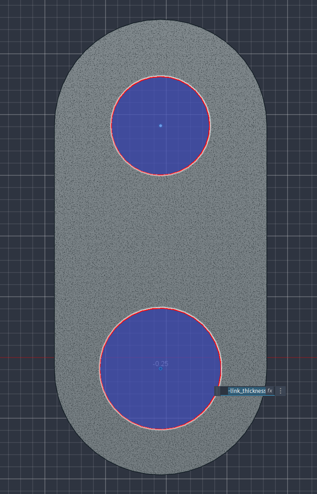

*Figure 18. Parametric cut forming both connection holes through the link plate.*

#### Completed Link

The completed link retained its connection to the bracket through the shared cylinder-diameter parameter.

The CAD model used basic hole sizes. The RC3 running/sliding fit and FN1 light press fit were specified through the hole tolerances and mating-shaft requirements on the drawing.

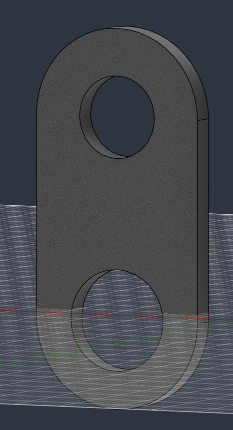

*Figure 19. Completed link model showing the two connection holes and rounded profile.*

## Decide

### Bracket Fits

The previously selected fits were applied to the bracket drawing based on the different movement and accuracy requirements at the T-beam interface.

The narrow slot uses an RC7 fit:

- Basic slot width: 0.5000 in
- Internal slot limits: 0.5000–0.5016 in
- Mating T-beam stem limits: 0.4970–0.4980 in
- Total width clearance: 0.0020–0.0046 in

Each side recess uses an RC3 fit:

- Basic recess dimension: 1.0000 in
- Internal recess limits: 1.0000–1.0008 in
- Corresponding T-beam dimension: 0.9987–0.9992 in
- Difference between corresponding dimensions: 0.0008–0.0021 in

The opening height uses an RC4 fit:

- Basic opening height: 1.5000 in
- Internal opening limits: 1.5000–1.5016 in
- Mating T-beam thickness: 1.4980–1.4990 in
- Vertical clearance: 0.0010–0.0036 in

The side-recess dimensional differences do not independently determine the assembled gaps on both sides. Those gaps also depend on the lateral position of the bracket relative to the T-beam.

### Link Fits

The upper hole uses an RC3 running/sliding fit with cylinder A.

- Upper hole limits: 0.8125–0.8133 in
- Cylinder A limits: 0.8112–0.8117 in
- Diametral clearance: 0.0008–0.0021 in

This provides clearance for relative movement at the connection.

The lower hole uses an FN1 light press fit with the 1-inch shaft.

- Lower hole limits: 1.0000–1.0005 in
- Mating shaft limits: 1.0008–1.0012 in
- Diametral interference: 0.0003–0.0012 in

The drawing includes the mating-shaft limits so both sides of each interface are defined.

### Geometric Tolerancing

One front face of the link was identified as datum A. Each hole was given a perpendicularity tolerance of diameter 0.005 in relative to that datum.

The 0.005 in value was a selected design tolerance. It limits the orientation error of each hole axis relative to the plate face. The hole-size tolerances separately establish the required fits.

Datum A on the link drawing identifies a surface and is distinct from the bracket feature named A.

### Drawing Format and General Tolerances

Separate bracket and link drawings were created using ASME settings and third-angle projection.

The bracket drawing uses a 1:3 scale to reduce dimension crowding. The link drawing uses a 1:2 scale. Both drawings include orthographic views, an isometric view, material information, and fit requirements.

General tolerances are:

- X.X: ±0.02 in
- X.XX: ±0.01 in
- X.XXX: ±0.005 in
- X.XXXX: ±0.005 in unless explicitly specified

The fourth-decimal general tolerance was added to cover dimensions such as 0.6875 and 0.1875 in. Explicit fit tolerances take priority over these general tolerances.

Reference dimensions are shown in parentheses when the size is already determined by other dimensions.

## Communicate

### Bracket Drawing

The bracket drawing communicates the T-slot geometry, support dimensions, cylinder size, and mating-fit requirements.

The notes specify ASTM A36 steel and identify the flush relationship between the rear faces of the upper block, support B, and cylinder A.

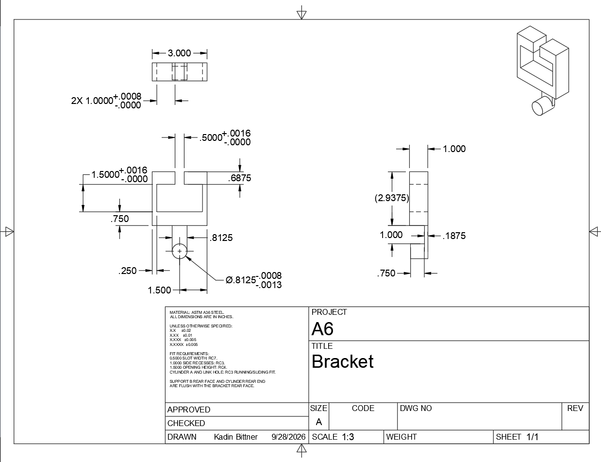

*Figure 20. Bracket drawing showing feature dimensions, T-slot fit tolerances, cylinder tolerance, and interface notes.*

[Download the bracket drawing PDF](A6_Bracket_Drawing.pdf)

### Link Drawing

The link drawing communicates the plate dimensions, hole spacing, hole-size tolerances, and mating-shaft requirements.

The datum and perpendicularity controls define the orientation requirements for the hole axes relative to the plate face.

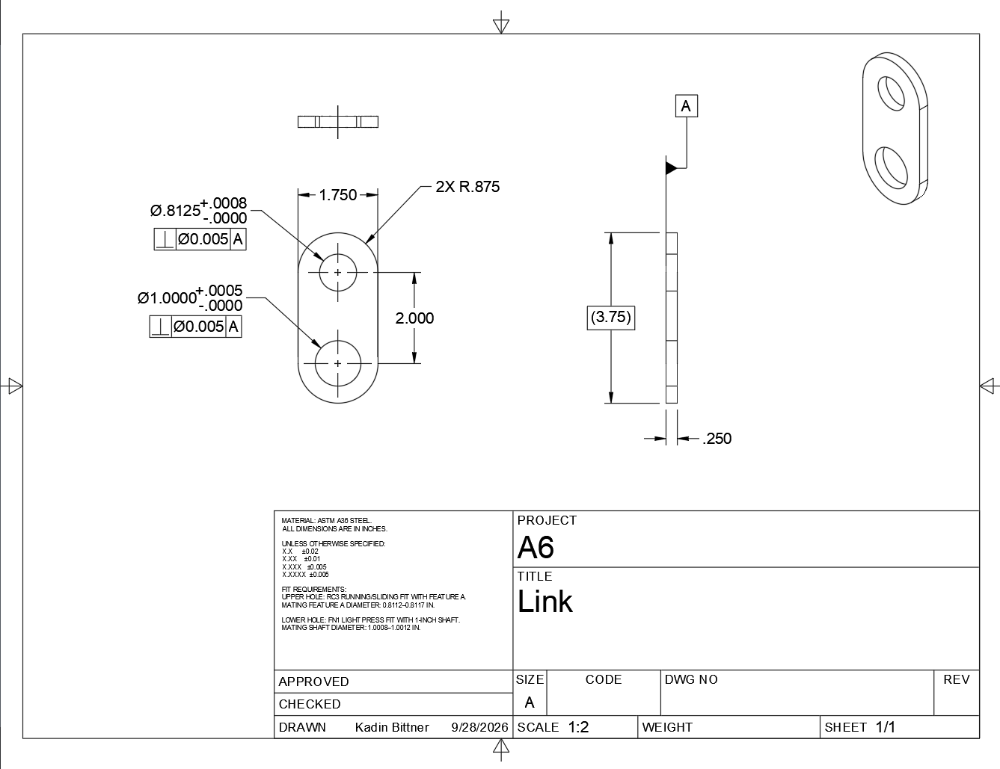

*Figure 21. Link drawing showing hole-size tolerances, datum A, perpendicularity controls, and mating-shaft requirements.*

[Download the link drawing PDF](A6_Link_Drawing.pdf)

### CAD Model

[Download the editable Fusion model](A6.f3d)

The Fusion file contains both the bracket and link, including the named parameters and expressions used to define their geometry.

## Lessons Learned

### Equation-Driven Geometry

Increasing the load from 1200 to 1500 lbf increased the calculated minimum thickness of feature C from 0.74162 to 0.82916 in.

Rounding upward to the selected 0.0625 in increment changed the modeled thickness from 0.750 to 0.875 in. The upper-block height also increased because it references the bottom thickness.

This demonstrated how an analytical equation can drive related CAD dimensions. It also showed that automatic updates only occur for features connected through parameter relationships.

### Tolerance Choice

The link interfaces require different behavior. The RC3 fit maintains clearance for movement at cylinder A, while the FN1 fit maintains interference at the 1-inch shaft.

Using the same basic diameter for mating features does not define their fit. The upper and lower size limits determine whether the manufactured parts have clearance or interference.

If the lower connection were given a clearance fit instead, it would no longer provide the intended press-fit connection.

### Modeling Process

Creating the link required changing the Fusion design type to Hybrid so a separate internal component could be added. This allowed the parts to share parameters while retaining separate drawings.

Support B was sketched on the back face and extruded toward the front. Defining its location from the rear face established the intended flush relationship with the upper block.

### Drawing Process and Corrections

A dimensional error initially produced an incorrect measurement when locating the cylinder center. Selecting the outside edge and cylinder center resolved the issue and demonstrated the importance of precision when creating technical drawings.

Drawing precision also affected the general tolerances; for example, displaying a width as 1.750 instead of 1.75 changed its applicable general tolerance from ±0.01 to ±0.005 in.

The bracket view scale was set to 1:3 to provide more separation between dimensions. The link used 1:2 because its simpler geometry required less annotation space. Adjusting the scale was important to the clarity of the drawing.

## Time Spent

- Bracket modeling and parameters: 1 hour
- Link modeling: 0.5 hours
- Drawings and tolerances: 2 hours
- Portfolio preparation: 3 hours
- Total: 6.5 hours

## References

1. MEGR 2156/2157, A6 assignment instructions
2. Previous Design for A5 assignment.
3. Machinery’s Handbook, 31st edition, Table 8a, page 654; Table 8b, page 655; and Table 11, page 659.
4. ASME Y14.5, Dimensioning and Tolerancing, course reference.
5. [Autodesk Fusion — Parameters](https://help.autodesk.com/cloudhelp/ENU/Fusion-Model/files/SLD-MODIFY-CHANGE-PARAMETERS.htm).
6. [Autodesk Fusion — Geometric Tolerancing Symbols](https://help.autodesk.com/cloudhelp/ENU/Fusion-Drawing/files/DWG-SYMBOLS.htm).
